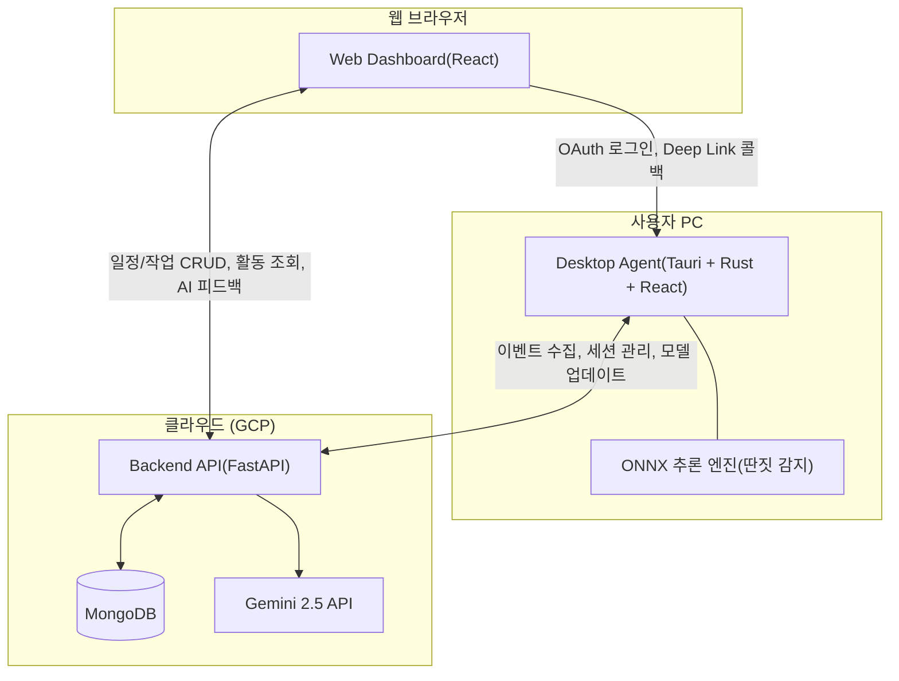

# Force-Focus

**인천대학교 캡스톤디자인 2025-2 ~ 2026-1**

사용자의 작업 환경을 강제로 실행하고, 딴짓이 감지되면 자동 개입하여 **작업 집중도를 향상**시키는 시스템입니다.

---

## 목차

- [시스템 개요](#시스템-개요)
- [시스템 아키텍처](#시스템-아키텍처)
- [기술 스택](#기술-스택)
- [프로젝트 구조](#프로젝트-구조)
- [빠른 시작](#빠른-시작)
- [팀 구성](#팀-구성)

---

## 시스템 개요

Force-Focus는 세 가지 핵심 컴포넌트로 구성됩니다:

| 컴포넌트 | 설명 | 상세 문서 |
|----------|------|-----------|
| **Desktop Agent** | 사용자 PC에서 실행되는 Tauri 기반 데스크톱 애플리케이션. 활동 모니터링, 세션 관리, ML 기반 딴짓 감지 및 강제 개입 수행 | [desktop-agent/README.md](desktop-agent/README.md) |
| **Backend API** | FastAPI 기반 REST API 서버. 인증, 데이터 저장, 일정·작업·세션·이벤트 관리, Gemini AI 피드백 연동 | [docs/README Backend.md](docs/README%20Backend.md) |
| **Web Dashboard** | React 기반 웹 대시보드. 일정/작업 관리, 활동 요약 시각화, AI 기반 맞춤형 피드백 제공 | [docs/web-dashboard.md](docs/web-dashboard.md) |

---

## 시스템 아키텍처



### 주요 데이터 흐름

1. **세션 실행**: 웹 대시보드에서 설정한 일정이 시작되면, Desktop Agent가 지정된 프로그램을 강제 실행
2. **활동 수집**: Agent가 활성 창, 입력 빈도, 앱 전환 등을 실시간 모니터링하고 이벤트로 기록
3. **딴짓 감지**: ONNX ML 모델이 사용자 활동 벡터를 분석하여 이탈 여부를 판단
4. **강제 개입**: 이탈 감지 시 오버레이를 표시하고 작업 환경 복구를 유도
5. **피드백 제공**: 세션 종료 후 웹 대시보드에서 Gemini 2.5 기반 AI 분석 피드백 확인

---

## 기술 스택

| 영역 | 기술 |
|------|------|
| **Desktop Agent** | Tauri v2, Rust, React 18, TypeScript, ONNX Runtime |
| **Backend API** | Python, FastAPI, Motor (Async MongoDB), JWT, Google OAuth |
| **Web Dashboard** | React 19, JavaScript, Zustand, Recharts, Axios |
| **Database** | MongoDB |
| **AI / ML** | OneClassSVM → ONNX 변환, Gemini 2.5 API |
| **인프라** | Docker, Docker Compose, GCP, Caddy (Reverse Proxy), Git LFS |

---

## 프로젝트 구조

```
Force-Focus/
├── desktop-agent/        # Tauri 데스크톱 에이전트 (Rust + React)
│   ├── src/              #   프론트엔드 소스 (React + TypeScript)
│   ├── src-tauri/        #   백엔드 소스 (Rust)
│   └── docs/             #   기술 문서 및 데모 영상
│
├── backend/              # FastAPI 백엔드 서버
│   ├── app/              #   애플리케이션 소스
│   └── Dockerfile        #   Docker 빌드 설정
│
├── web-dashboard/        # React 웹 대시보드
│   ├── src/              #   프론트엔드 소스
│   └── Dockerfile        #   Docker 빌드 설정
│
├── docs/                 # 프로젝트 전체 문서
│   ├── README Backend.md #   백엔드 기술 문서
│   ├── web-dashboard.md  #   웹 대시보드 기술 문서
│   └── desktop-agent/    #   데스크톱 에이전트 기술 문서 인덱스
│
├── docker-compose.yml    # 전체 서비스 오케스트레이션
├── .env.example          # 환경변수 템플릿
└── README.md             # 이 파일
```

---

## 빠른 시작

### 서버 (Backend + Web Dashboard + MongoDB)

```bash
# 1. 환경변수 설정
cp .env.example .env
# .env 파일을 열고 MongoDB 비밀번호, SECRET_KEY 등을 수정

# 2. Docker Compose로 전체 서비스 실행
docker-compose up --build
```

실행 후 접근 가능한 서비스:

| 서비스 | URL |
|--------|-----|
| Web Dashboard | http://localhost |
| Backend API | http://localhost:8000 |
| MongoDB | localhost:27017 |

### Desktop Agent

Desktop Agent는 별도로 빌드하여 사용자 PC에서 실행합니다.
상세한 설정 및 빌드 방법은 [desktop-agent/README.md](desktop-agent/README.md)를 참고하세요.

```bash
cd desktop-agent
npm install

# 개발 모드 실행
npm run tauri dev

# 프로덕션 빌드
npm run tauri build
```

---

## 팀 구성

| 이름 | 역할 | 담당 | 주요 작업 |
|------|------|------|-----------|
| **igoobo** | PM · Tech Lead | Desktop Agent, ML | 프로젝트 관리, Tauri 앱 개발, Rust 백엔드, ML 추론 엔진, 시스템 아키텍처 설계 |
| **AMH-inu** | Web Dashboard Lead | Web Dashboard | React 대시보드 UI, 일정/작업/피드백 화면, 사용자 인터페이스 |
| **PKT0623** | Developer | Backend API | FastAPI 서버, CRUD 로직, 이벤트/세션 데이터 처리, DB 설계 |
