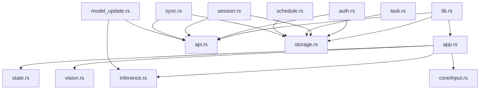

# 시스템 아키텍처 개요

> **프로젝트**: Force-Focus Desktop Agent
> **기술 스택**: Tauri 2 (Rust) + React 18 (TypeScript) + ONNX Runtime
> **작성일**: 2026-03-21
> **최종 업데이트**: 2026-04-25 (Workspace Snapshot & Restore 기능 반영)

---

## 1. 전체 아키텍처

```mermaid
graph TB
    subgraph "Frontend (React 18 + TypeScript)"
        FE_APP["App.tsx<br/>상태 기반 라우팅"]
        FE_LOGIN["LoginView<br/>Google OAuth"]
        FE_MAIN["MainView<br/>Tauri invoke 기반"]
        FE_SETTINGS["SettingsView<br/>자동시작 설정"]
        FE_OVERLAY["InterventionOverlay<br/>개입 오버레이"]
        FE_WIDGET["widget.html<br/>플로팅 위젯"]
    end

    subgraph "Tauri IPC Bridge"
        INVOKE["invoke() / listen()"]
    end

    subgraph "Backend (Rust + Tauri 2)"
        subgraph "Core Layer"
            LIB["lib.rs<br/>진입점 + 상태 등록"]
            APP["app.rs<br/>메인 루프 (1s FSM + 5s ML)"]
            STATE["state.rs<br/>FSM (FOCUS↔DRIFT↔DISTRACTED)"]
            INPUT_CORE["core/input.rs<br/>rdev 입력 감지"]
        end

        subgraph "Commands Layer (9파일)"
            CMD_AUTH["auth.rs<br/>login/logout"]
            CMD_SESSION["session.rs<br/>세션 관리 + 피드백"]
            CMD_TASK["task.rs<br/>태스크 조회"]
            CMD_SYS["system.rs<br/>프로세스 목록"]
            CMD_WIN["window.rs<br/>오버레이 제어"]
            CMD_VIS["vision.rs<br/>Win32 API + 시맨틱 토큰화<br/>+ Workspace Snapshot/Restore"]
            CMD_INP["commands/input.rs<br/>InputStats 구조체"]
            CMD_ML["ml.rs<br/>모델 업데이트 트리거"]
        end

        subgraph "AI Layer (3파일)"
            INFER["inference.rs<br/>ONNX 추론 + Local Cache"]
            MODEL["model_update.rs<br/>모델 핫스왑"]
        end

        subgraph "Managers Layer"
            STORAGE["storage.rs<br/>SQLite (6 테이블)"]
            SCHEDULE["schedule.rs<br/>스케줄 모니터"]
            SYNC["sync.rs<br/>양방향 동기화"]
            TRAY["tray.rs<br/>시스템 트레이"]
            WIDGET_MGR["widget.rs<br/>위젯 관리"]
        end

        subgraph "Utils Layer (3파일)"
            API_MOD["api.rs<br/>HTTP 클라이언트 + DTO"]
            LOG["logging.rs<br/>JSONL 파일 로거"]
        end
    end

    subgraph "External"
        API["Backend API<br/>(GCP)"]
        DB[(SQLite<br/>local.db)]
        ONNX[(ONNX Model<br/>personal_model.onnx)]
        GMAP[("global_map.json<br/>토큰→점수 매핑")]
    end

    FE_APP --> INVOKE
    INVOKE --> CMD_AUTH
    INVOKE --> CMD_SESSION
    INVOKE --> CMD_TASK
    INVOKE --> CMD_WIN
    APP --> STATE
    APP --> INFER
    APP --> CMD_VIS
    INFER --> ONNX
    STORAGE --> DB
    SYNC --> API
    CMD_AUTH --> API_MOD
    CMD_SESSION --> API_MOD
    API_MOD --> API
    MODEL --> API_MOD
    APP --> GMAP
```



---

## 2. 핵심 동작 루프

```
매 1초 (FSM Tick):
  1. 세션 활성 확인 (SessionState)
  2. widget-tick 이벤트 브로드캐스트
  3. InputStats에서 현재 입력 상태 읽기
  4. FSM 상태 전이 (state.rs → drift_gauge 적분 제어)
  5. 상태 전이 감지 → FOCUS 진입 시 Workspace Snapshot 캡처
  6. 개입 판단 (notification / overlay / do_nothing)

매 5초 (Slow Path — ML Sensing):
  1. 활성 창 감지 (vision.rs → Win32 API)
  2. 시맨틱 토큰화 (vision.rs → extract_semantic_keywords)
  3. 원본 창 제목 → 토큰으로 세탁 (개인정보 보호)
  4. Context Score 산출 (app.rs → global_map.json 룩업)
  5. 6차원 ML 특성 벡터 생성 (app.rs inline)
  6. 이벤트 캐싱 (storage.rs → SQLite)
  7. ONNX 모델 추론 (inference.rs → Local Cache 확인 → Standard Scaling → 추론)
  8. Score → InferenceResult 판정 (>0: Inlier, >-0.5: Weak, ≤-0.5: Strong)
```

---

## 3. 상태 관리 패턴

| 상태 | 타입 | 관리 방식 | 접근 |
|------|------|-----------|------|
| `SessionState` | `Option<ActiveSessionInfo>` | `Arc<Mutex<>>` | Tauri `.manage()` |
| `InputStats` | 구조체 | `Arc<Mutex<>>` | Tauri `.manage()` |
| `AppCore` | FSM + ML + global_map + Snapshot | `Mutex<>` | Tauri `.manage()` |
| `StorageManager` | SQLite + XOR obfuscation | `Arc<Mutex<>>` | Tauri `.manage()` |
| `BackendCommunicator` | HTTP Client | `Arc<>` | Tauri `.manage()` |
| `SysinfoState` | `sysinfo::System` | `Mutex<>` | Tauri `.manage()` |

---

## 4. 모듈 의존 관계



---