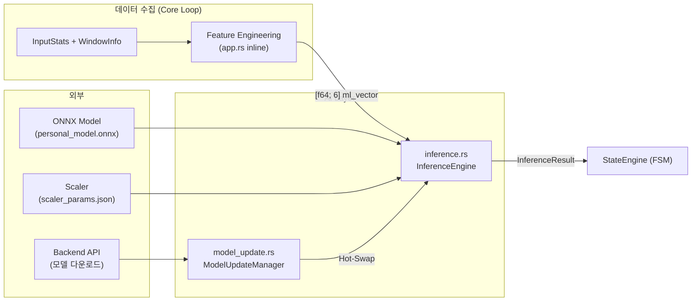
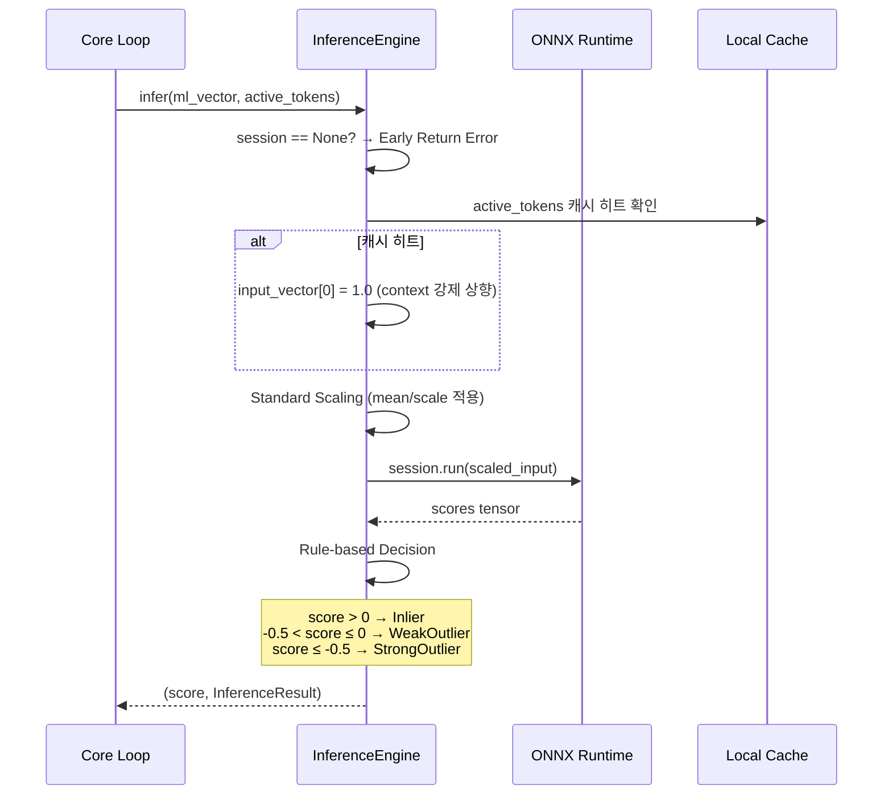
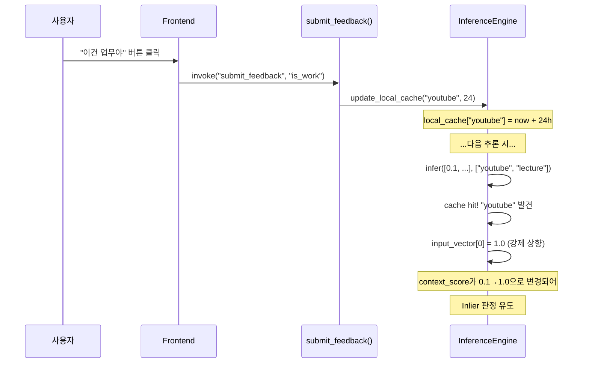
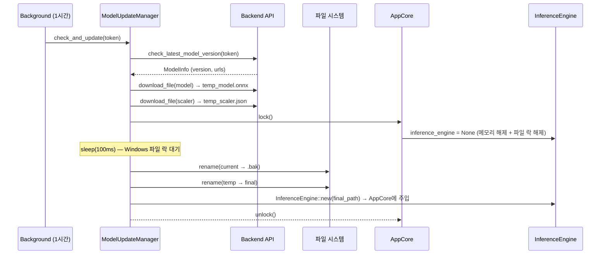

# AI Layer — 코드 리뷰 & 기술 문서

> **범위**: `ai/mod.rs`, `ai/inference.rs`, `ai/model_update.rs`
> **리뷰 일자**: 2026-03-21
> **최종 업데이트**: 2026-04-12 (Phase 3 데드코드 제거, 세부 구현 문서화)

---

## 1. 아키텍처 개요 — ML 추론 파이프라인



> ⚠️ Phase 3(커밋 `fe89e11`)에서 `feature.rs`가 삭제되었습니다. 피처 계산은 `core/app.rs`의 `start_core_loop()` 내부에서 인라인으로 수행됩니다.

**ML 벡터 6차원 구성:**

| Index | Feature | 계산 방식 | 범위 |
|-------|---------|-----------|------|
| 0 | `context_score` | 앱/제목 토큰 → global_map 룩업 평균 | -1.0 ~ 1.0 |
| 1 | `log_input` | `ln(delta + 1)`, delta는 max 50으로 clip | 0 ~ ~3.93 |
| 2 | `silence_sec` | 마지막 입력 이후 경과 시간(초) | 0 ~ ∞ |
| 3 | `burstiness` | delta_history 표준편차 (1분 윈도우) | 0 ~ ∞ |
| 4 | `mouse_active` | 5초 내 마우스 이동 여부 (binary) | 0.0 / 1.0 |
| 5 | `interaction_gate` | `sigmoid(1/(delta+0.1)) × context` | 0 ~ 1.0 |

---

## 2. 파일별 상세 리뷰

---

### 2.1 `ai/mod.rs` (2줄)

```rust
pub mod inference;
pub mod model_update;
```

✅ Phase 3에서 `feature` 모듈 제거됨. 현재 2개 모듈만 선언.

---

### ~~2.2 `ai/feature.rs`~~ — ✅ 삭제됨 (Phase 3, 커밋 `fe89e11`)

> 이 파일은 `AppCore::start_core_loop()`에서 동일한 피처 계산을 인라인으로 수행하여 **dead code**로 판명, Phase 3에서 삭제되었습니다.
> 삭제 전 불일치 내역: 모집단/표본 StdDev 수식, 윈도우 크기 (60 vs 12), interaction_gate 조건 분기.
> 상세는 §4 "핵심 의사결정 기록" 참조.

---

### 2.3 `ai/inference.rs` (174줄) — 💥 ONNX 추론 엔진

#### 핵심 구조

```rust
pub struct InferenceEngine {
    session: Option<Session>,       // ONNX Runtime (None = unloaded)
    scaler: ScalerParams,           // StandardScaler (mean/scale)
    model_path: PathBuf,            // 현재 모델 경로
    scaler_path: PathBuf,           // 스케일러 경로
    local_cache: HashMap<String, Instant>, // 피드백 캐시 (TTL 기반)
}
```

#### 추론 흐름



#### Score → InferenceResult 판정 임계값 (L186-193)

| 조건 | 결과 | 의미 | FSM Multiplier |
|------|----|------|---------|
| `score > 0.0` | `Inlier` | 정상 (업무 중) | -2.0 (빠른 회복) |
| `-0.5 < score ≤ 0.0` | `WeakOutlier` | 애매한 이탈 | +0.5 (지연 축적) |
| `score ≤ -0.5` | `StrongOutlier` | 확정적 이탈 | +1.0 (실시간 축적) |

> -0.5 임계값은 **Isolation Forest** 모델의 decision score 분포에서 도출됨.
> 0.0 경계는 모델의 inlier/outlier 기본 결정 경계.

#### Standard Scaling 전처리 (L168-173)

ML 벡터를 ONNX 모델에 입력하기 전, `scaler_params.json`에서 로드한 파라미터로 Standard Scaling을 적용합니다.

```
scaled[i] = (raw[i] - scaler.mean[i]) / scaler.scale[i]
```

| 단계 | 설명 |
|------|------|
| 1. 스케일러 로드 | `scaler_params.json` → `ScalerParams { mean: Vec<f64>, scale: Vec<f64> }` |
| 2. 정규화 | 각 피처별 `(value - mean) / scale` |
| 3. 타입 변환 | `f64` → `f32` 다운캐스트 (ONNX 입력 형식) |
| 4. 텐서 생성 | `Array2<f32>::zeros((1, 6))` → `Value::from_array()` |
| 5. 추론 | `session.run(inputs!["float_input" => tensor])` |
| 6. 출력 | `outputs["scores"].try_extract_tensor::<f32>()` → `scores[0]` |

#### Local Cache 피드백 메커니즘 (L127-166)

사용자가 "나 일하는 중이야" 피드백을 주면, 해당 앱의 토큰을 캐시에 등록하여
**같은 앱을 사용할 때 일정 시간 동안 False Positive를 방지**합니다.



| 항목 | 구현 |
|------|------|
| **캐시 키** | 앱 토큰 (e.g. `"youtube"`, `"figma"`) |
| **캐시 값** | `Instant` (TTL 만료 시간) |
| **기본 TTL** | 24시간 |
| **히트 시 동작** | `input_vector[0] = 1.0` (context_score 강제 만점) |
| **만료 처리** | Lazy Deletion — 만료된 캐시는 조회 시 무시 (borrow checker 제약) |
| **제한** | 토큰 중 **하나라도** 히트하면 Trusted로 간주 |

#### ONNX 세션 Lifecycle — Unload/Load/Reload (L78-122)

Windows에서 ONNX 모델 파일을 업데이트할 때 File Lock 문제가 발생합니다.
`Option<Session>`으로 세션 상태를 관리하여 해결합니다.

| 함수 | 동작 | 스케일러 갱신 |
|------|------|----------|
| `unload_model()` | `session = None` → OS 파일 핸들 반환 | ❌ |
| `load_model(path)` | 모델만 새로 로드 (스케일러는 기존 경로 재사용) | ❌ |
| `reload(path)` | Unload → `sleep(100ms)` → 모델 + **스케일러 모두** 새로 로드 | ✅ |

> ⚠️ **불일치 주의 (A-6)**: `reload()`은 스케일러를 갱신하지만 `load_model()`은 갱신하지 않습니다.
> 모델과 스케일러가 항상 쌍으로 업데이트되는 경우 `load_model`을 사용하면 불일치가 발생합니다.

#### 심층 분석

| 카테고리 | 항목 | 분석 |
|----------|------|------|
| **🟢 설계** | **Hot-Swap 패턴** | `unload_model()` → sleep(100ms) → `load_resources()`. Windows 파일 락 해결을 위한 실용적 접근 ✅ |
| **🟢 설계** | **Option\<Session\>** | 모델 언로드 상태를 타입 시스템으로 표현. `infer()` 시작 시 None 체크 ✅ |
| **🟢 설계** | **Local Cache** | 사용자 피드백("이건 업무야") → 토큰 기반 TTL 캐시. False Positive 감소 ✅ |
| **🟡 메모리** | L151-161 `for token in active_tokens` | `active_tokens`의 소유권을 가져와서 소비. 호출자가 clone 필요 (현재 `app.rs`에서 `active_tokens.clone()` 사용) |
| **🟡 성능** | L157-158 만료 캐시 Lazy Deletion | 주석에 "borrow checker 이슈 가능성" 언급. 실제로 `HashMap::retain()` 사용하면 해결 가능 |
| **🟡 안전성** | L180-181 `scores.1[0]` | 인덱스 접근 — ONNX 출력 텐서가 비어있으면 **패닉**. 바운드 체크 권장 |
| **🟡 설계** | L31 주석 "Thread-safe하지 않으므로 &mut 접근 필요" | `Session`을 `Mutex` 안에서 사용하므로 실제로는 안전. 주석 업데이트 필요 |
| **🟢 에러** | `new()`, `load_resources()`, `reload()` 모두 `Result` 반환 ✅ |

---

### 2.4 `ai/model_update.rs` (112줄) — 모델 업데이트 매니저

#### 업데이트 흐름



#### 심층 분석

| 카테고리 | 분석 |
|----------|------|
| **🟢 설계** | Atomic Swap 패턴: temp 다운로드 → rename → 새 엔진 생성. 중간에 실패해도 기존 파일 보존 ✅ |
| **🟡 에러** | L79 `let _ = std::fs::rename(...)` — 백업 파일 생성 실패를 무시. 기존 모델이 없는 첫 실행에는 문제없지만, 로그 추가 권장 |
| **✅ 에러** | L86 `final_model_path.to_str().unwrap()` — **FIXED** (커밋 9df0b7e): `unwrap_or_default()`로 변경. 비-ASCII 경로 패닉 방지 |
| **✅ 에러** | L116 `storage_mutex.lock().unwrap()` — **FIXED** (커밋 9df0b7e): `match` 패턴으로 변경. 백그라운드 루프 패닉 방지 |
| **🟡 설계** | L52 "TODO: 로컬 버전과 비교 로직 추가" — 버전 비교 없이 매번 다운로드 시도. 불필요한 네트워크 트래픽 |
| **🟡 성능** | L75 `std::thread::sleep(100ms)` — 비동기 함수 내에서 동기 sleep 사용. `tokio::time::sleep` 권장 (tokio 스레드풀 블로킹 방지) |
| **🟡 설계** | L94-97 새 모델 로드 실패 시 `.bak` 파일에서 복구 로직이 없음. 주석에 "생략" 명시 |
| **🟡 에러** | L128-131 에러 출력이 주석 처리됨. 백그라운드 오류를 완전히 삼킴 |

---

### 2.5 `core/state.rs` (271줄) — State Machine (FSM)

`InferenceEngine`의 결과를 받아 최종적인 **개입 여부(Intervention)**를 결정하는 유한 상태 머신(FSM)입니다.

#### 개입 흐름 (State Diagram)

```mermaid
stateDiagram-v2
    [*] --> FOCUS
    
    state "FOCUS (몰입)" as FOCUS
    state "DRIFT (유예/주의)" as DRIFT
    state "DISTRACTED (이탈)" as DISTRACTED

    %% 상태 전이 규칙
    FOCUS --> DRIFT : Gauge ≥ 30s
    DRIFT --> DISTRACTED : Gauge ≥ 60s
    DISTRACTED --> DRIFT : Gauge < 60s
    DRIFT --> FOCUS : Gauge < 30s

    %% 누적 로직 설명
    note right of FOCUS
        <b>게이지 누적/회복 계수 (Multiplier)</b>
        • StrongOutlier: +1.0 (실시간 속도)
        • WeakOutlier: +0.5 (지연 속도)
        • ActiveThinking: +0.25 (Safety Net: 마우스만 움직임)
        • Inlier (Work): -2.0 (빠른 회복)
    end note

    %% 개입 발동
    DRIFT --> DRIFT : Trigger Notification (10s 간격)
    DISTRACTED --> DISTRACTED : Trigger Overlay (10s 간격)

    %% 수동 초기화
    FOCUS --> FOCUS : Manual Reset
    DRIFT --> FOCUS : Manual Reset
    DISTRACTED --> FOCUS : Manual Reset
```



#### 핵심 로직 요약

| 항목 | 내용 | 비고 |
|------|------|------|
| **Drift Gauge** | 0.0 ~ 90.0 (Block + 30s 여유) | 누적된 이탈 시간 (초) |
| **Thresholds** | 30.0 (DRIFT), 60.0 (DISTRACTED) | 개입 발동 임계값 |
| **Multiplier** | 상황별 가중치 (Inlier 시 -2.0으로 급속 회복) | `calculate_multiplier()` |
| **Snooze** | 10.0초 (SNOOZE_SEC) | 개입 후 동일 수준 개입 재발생 억제 |
| **Safety Net** | !has_recent_input && is_mouse_active | `WeakOutlier` 가속도를 절반으로 감쇄 |

#### 심층 분석

| 카테고리 | 분석 |
|----------|------|
| **🟢 설계** | **Leaky Bucket 패턴** — 급격한 상태 변화를 방지하고 점진적으로 에스컬레이션되는 구조 ✅ |
| **🟢 설계** | **Snooze Logic** — 10초간 재알림을 억제하여 사용자 피로도(Intervention Fatigue) 관리 ✅ |
| **✅ 에러** | L78 `drift_gauge` 상한 제한 없음 → **FIXED** (커밋 6ecccc6): `max_gauge` 변수를 도입하여 상한선(90s) 적용 |
| **🟡 설계** | `calculate_multiplier()`에서 `StrongOutlier`에는 Safety Net이 적용되지 않음. 문서 읽기 등 "마우스만 사용하는 몰입 상황"이 StrongOutlier로 판정될 가능성 검토 필요 |

---

## 3. 발견 사항 요약

### 🔴 높은 우선순위

| # | 파일 | 라인 | 이슈 |
|---|------|------|------|
| A-1 | model_update.rs | 86 | `to_str().unwrap()` 비-ASCII 패닉 | ✅ FIXED (9df0b7e) |
| A-2 | model_update.rs | 116 | `lock().unwrap()` 백그라운드 패닉 | ✅ FIXED (9df0b7e) |
| A-3 | inference.rs | 180-181 | `scores.1[0]` 인덱스 패닉 | ✅ FIXED |

### 🟡 중간 우선순위

| # | 파일 | 이슈 |
|---|------|------|
| A-4 | feature.rs | **전체 파일이 dead code** — `AppCore`에서 인라인 구현 사용 | ✅ FIXED (삭제됨) |
| A-5 | feature.rs vs app.rs | burstiness 계산 수식 불일치 (모집단 vs 표본 StdDev) | ✅ FIXED (feature.rs 삭제) |
| A-6 | inference.rs | `reload()` vs `load_model()` 스케일러 갱신 동작 불일치 |
| A-7 | model_update.rs | 비동기 함수 내 동기 `thread::sleep` 사용 |
| A-8 | model_update.rs | 모델 로드 실패 시 복구 로직 없음 |
| A-9 | model_update.rs | 버전 비교 없이 매번 다운로드 (TODO 미완) |

### 🟢 낮은 우선순위

| # | 파일 | 이슈 |
|---|------|------|
| A-10 | inference.rs | 만료 캐시 Lazy Deletion → `retain()` 사용 가능 |
| A-11 | inference.rs | Thread-safety 주석 업데이트 필요 |
| A-12 | model_update.rs | 에러 출력 주석 처리 (silent failure) |

---

## 4. 핵심 의사결정 기록

### feature.rs가 dead code가 된 이유

| 항목 | 내용 |
|------|------|
| **기존** | `FeatureExtractor` 독립 모듈로 피처 계산을 담당 |
| **변경** | `AppCore::start_core_loop()` 내부에서 피처 계산을 인라인으로 직접 수행 |
| **이유** | Core Loop에서 `AppCore`의 여러 필드(`last_event_count`, `delta_history`, `global_map`)에 직접 접근해야 하므로, 별도 모듈로 분리하면 데이터 전달이 복잡해짐 |
| **결과** | 두 구현 간 **수학적 불일치** 발생 (StdDev 공식, 윈도우 크기, interaction_gate 로직) |
| **권장** | feature.rs 삭제 또는 AppCore와 통합. 현재 상태는 유지보수 혼란 유발 |

### FSM 게이지 적분 제어의 효용성

| 항목 | 내용 |
|------|------|
| **의도** | 1회성 ML 추론 결과에 일희일비하지 않고, **지속적인 이탈 경향성**을 감지 |
| **효과** | 잠깐 브라우저를 켠 정도로는 개입하지 않지만, 30초~1분 이상 업무와 상관없는 행위가 지속될 때만 단계적(알림→차단)으로 개입하여 사용자 경험 방해 최소화 |
