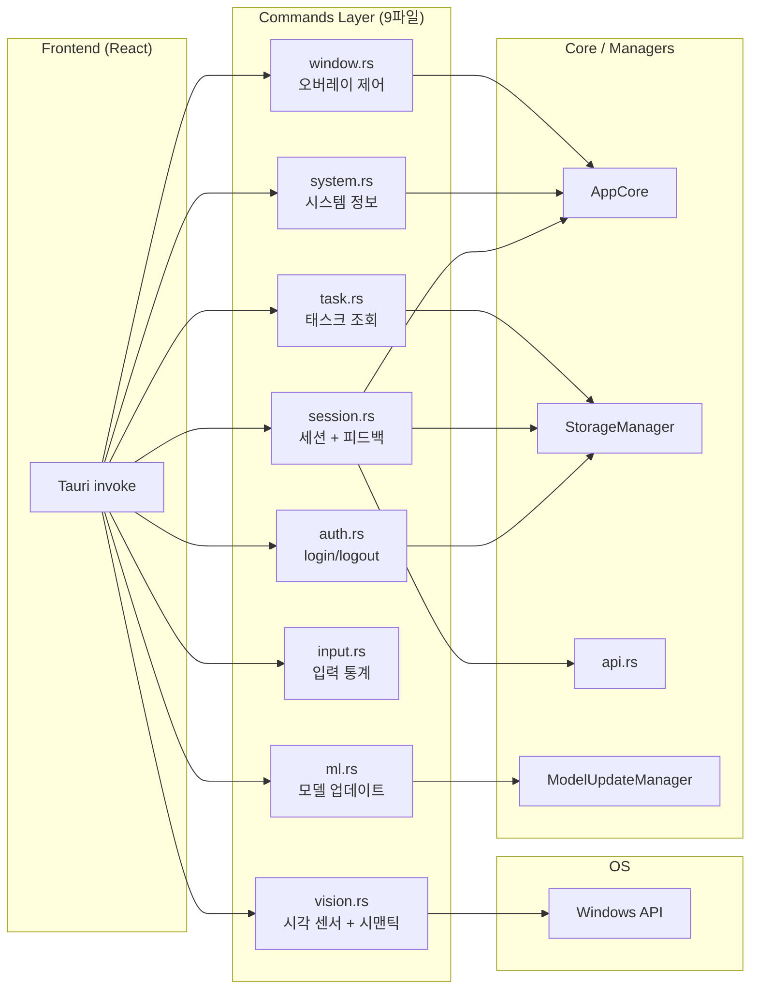
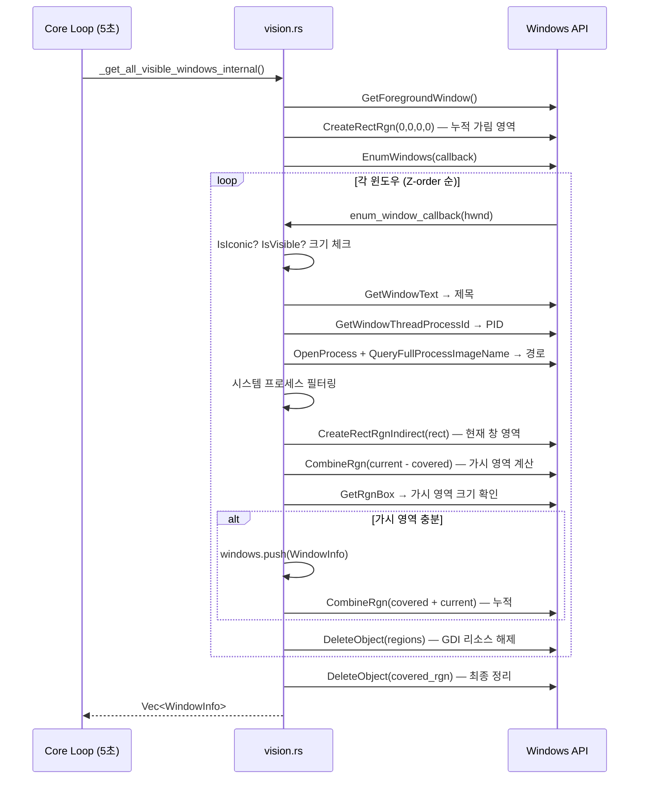
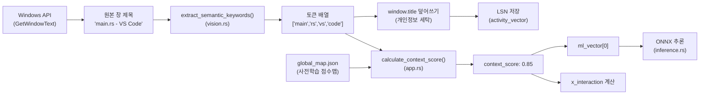
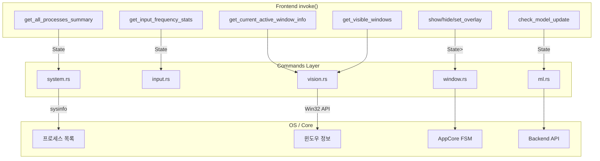

# Commands Layer — 코드 리뷰 & 기술 문서

> **범위**: `commands/mod.rs`, `commands/auth.rs`, `commands/session.rs`, `commands/task.rs`, `commands/system.rs`, `commands/window.rs`, `commands/input.rs`, `commands/vision.rs`, `commands/ml.rs`
> **리뷰 일자**: 2026-03-21
> **최종 업데이트**: 2026-04-19 (모듈 분리 반영)

---

## 1. 아키텍처 개요



**역할**: Frontend(React)에서 `invoke()`로 호출되는 Tauri 커맨드 레이어. 비즈니스 로직은 Core/Managers에 위임하고, 이 레이어는 **데이터 변환 + 상태 접근의 진입점** 역할.

---

## 2. 파일별 상세 리뷰

---

### 2.1 `commands/mod.rs` (8줄)

```rust
pub mod auth;
pub mod input;
pub mod ml;
pub mod session;
pub mod system;
pub mod task;
pub mod vision;
pub mod window;
```

✅ `auth`, `session`, `task` 모듈 추가됨. 현재 8개 모듈 선언.

---

### 2.2 `commands/auth.rs` (46줄) — 인증 커맨드

> `backend_comm.rs`의 인증 로직을 분리한 파일.

| 커맨드 | 역할 | 상태 접근 |
|--------|------|----------|
| `login` | OAuth 토큰 4종 StorageManager에 저장 | `StorageManagerArcMutex` |
| `logout` | LSN 토큰 삭제 | `StorageManagerArcMutex` |
| `check_auth_status` | LSN에서 토큰 로드 → 이메일 반환 (자동 로그인용) | `StorageManagerArcMutex` |

| 카테고리 | 분석 |
|----------|------|
| **🟢 보안** | 로그에서 이메일 `[REDACTED]`로 마스킹 ✅ |
| **🟢 에러** | 모든 Lock에 `.map_err(\|e\| e.to_string())?` 패턴 적용 ✅ |
| **🟢 설계** | 간결한 위임 패턴 — 로직은 StorageManager에 집중 ✅ |

---

### 2.3 `commands/session.rs` (244줄) — 세션 관리 + 피드백

> `backend_comm.rs`의 세션/피드백 로직을 분리한 파일. Commands Layer에서 **가장 복잡한 파일**.

| 커맨드 | 역할 | 패턴 |
|--------|------|------|
| `submit_feedback` | FSM 즉시 리셋 → LSN 캐시 → spawn(서버 전송) | Offline-First |
| `start_session` | 로컬 세션 생성 → spawn(서버 동기화) | Offline-First |
| `end_session` | 로컬 세션 삭제 + 오버레이 숨김 → spawn(서버 알림) | Offline-First |
| `get_current_session_info` | 타이머 위젯 동기화용 PULL API | Sync Read |

| 카테고리 | 분석 |
|----------|------|
| **🟢 동시성** | Lock 범위를 `{ }` 블록으로 최소화 → API 호출 중 Lock 미보유 ✅ |
| **🟢 설계** | `submit_feedback`: FSM 즉시 리셋 → Local Cache → 백그라운드 전송. 우수한 UX 설계 ✅ |
| **🟢 비동기** | `start_session`/`end_session` — 동기 Lock + 비동기 spawn 분리 ✅ |
| **🟡 에러** | `end_session` 내부 `window.hide()` 실패 시 `let _ =`으로 무시. 로그 추가 권장 |

---

### 2.4 `commands/task.rs` (53줄) — 태스크 조회

> `backend_comm.rs`의 Task 로직을 분리한 파일.

| 커맨드 | 역할 | 상태 접근 |
|--------|------|----------|
| `get_tasks` | LSN에서 `LocalTask` 조회 → `Task` 매핑 → 프론트엔드 반환 | `StorageManagerArcMutex` |

| 카테고리 | 분석 |
|----------|------|
| **🟢 설계** | `LocalTask` → `Task` 변환 로직 포함. `Option` 필드를 `unwrap_or_default()`로 안전 처리 ✅ |
| **🟡 설계** | `target_arguments` 를 `split_whitespace()`로 분리하여 `Vec<String>` 변환. 공백 포함 인자 처리 불가 |
| **🟡 보안** | `user_id`를 로그에 평문 출력 (L27-29). `[REDACTED]` 마스킹 권장 |

---

### 2.5 `commands/system.rs` (29줄) — 시스템 정보 커맨드

#### 구조

| 항목 | 내용 |
|------|------|
| `SysinfoState` | `Mutex<System>` 래핑 뉴타입. 시스템 정보 쿼리용 |
| `ProcessSummary` | `name` + `start_time_unix_s` 구조체 |
| `get_all_processes_summary` | 전체 프로세스 목록 반환 (Tauri 커맨드) |
| `get_system_stats` | AppCore에서 FSM 상태/게이지 비율 반환 (Tauri 커맨드) |

#### 심층 분석

| 카테고리 | 분석 |
|----------|------|
| **✅ 에러** | L20 `sys_state.0.lock().unwrap()` — **FIXED** (커밋 cb9aa47): `.map_err()` 패턴으로 변경. `get_system_stats`와 패턴 통일 |
| **🟡 성능** | L21 `refresh_all()` — `refresh_processes()` 변경을 시도했으나, 파라미터 없이 동작하지 않아 **revert** (커밋 984a64b). 향후 `refresh_processes_specifics()` 등 대안 검토 필요 |
| **🟡 설계** | `SysinfoState`가 여기(`commands/system.rs`)에 정의되어 있고, `lib.rs`에도 동일 이름의 타입이 있음 → core.md 발견 6번과 연결. 실제로 `lib.rs`의 것은 `use crate::commands::system::SysinfoState`로 참조 가능하지만, `lib.rs`에서도 별도 `SysinfoState`를 선언함 |
| **🟡 설계** | `get_system_stats`는 `invoke_handler`에 등록되지 않음 (lib.rs 확인). dead code 가능성 |
| **🟢 테스트** | 테스트 없음 |

---

### 2.6 `commands/window.rs` (57줄) — 오버레이 윈도우 제어

#### 3개 Tauri 커맨드

| 커맨드 | 역할 | 파라미터 |
|--------|------|----------|
| `hide_overlay` | 오버레이 숨김 + FSM 리셋 | `AppHandle`, `State<Mutex<AppCore>>` |
| `show_overlay` | 오버레이 표시 + always_on_top | `AppHandle` |
| `set_overlay_ignore_cursor_events` | 마우스 통과/차단 전환 | `AppHandle`, `ignore: bool` |

#### 심층 분석

| 카테고리 | 분석 |
|----------|------|
| **🟢 동시성** | `hide_overlay` L14: `state.lock().map_err()` — AppCore Lock이 안전하게 처리됨 ✅ |
| **🟢 동시성** | L13-17: `{ }` 스코프로 Lock 범위 최소화 → Lock 해제 후 창 숨김 수행. 데드락 방지 패턴 ✅ |
| **🟢 에러** | 모든 커맨드가 `Result<(), String>` 반환. `map_err(|e| e.to_string())` 패턴 일관 적용 ✅ |
| **🟡 설계** | `hide_overlay`에서 `manual_reset()` 호출 → FSM 게이지가 0으로 초기화됨. `core/app.rs`의 자연 회복(gauge 유지)과는 다른 동작. 의도적 설계이지만 주의 필요 |
| **🟢 보안** | 창 숨길 때 `set_ignore_cursor_events(false)` 복구 — 다음 보여줄 때 안전 ✅ |

---

### 2.7 `commands/input.rs` (69줄) — 입력 통계 구조체 & 커맨드

#### 구조

```rust
pub struct InputStats {
    pub meaningful_input_events: u64,        // 유의미 이벤트 카운트
    pub last_meaningful_input_timestamp_ms: u64,  // 마지막 키/클릭 시간
    pub last_mouse_move_timestamp_ms: u64,   // 마지막 마우스 이동 시간
    pub start_monitoring_timestamp_ms: u64,  // 모니터링 시작 시간
    pub visible_windows: Vec<WindowInfo>,    // 현재 보이는 창 목록
}
```

#### 심층 분석

| 카테고리 | 분석 |
|----------|------|
| **✅ 에러** | L34 `lock().unwrap()` — **FIXED** (커밋 cb9aa47): `.map_err()` 패턴으로 변경. Tauri 커맨드에서 패닉 대신 에러 반환 |
| **🟡 메모리** | L35 `(*stats).clone()` — `InputStats`에 `Vec<WindowInfo>`가 포함되어 있으므로 **깊은 복사** 발생. 프론트엔드가 자주 호출하면 부하 가능. 그러나 Tauri 커맨드는 수동 호출이므로 실질적 문제 아님 |
| **🟡 설계** | L28 `pub type InputStatsArcMutex = Arc<Mutex<InputStats>>` — `lib.rs`에도 동일 타입 별칭이 정의되어 있음 (**중복 정의**). 하나로 통합 권장 |
| **🟢 테스트** | `to_activity_vector_json()` 직렬화 테스트 존재 ✅. `start_monitoring_timestamp_ms` 미포함 검증까지 커버 |
| **🟡 설계** | `to_activity_vector_json()`에서 `start_monitoring_timestamp_ms`가 스펙상 의도적으로 제외됨. 코드 주석에 명시되어 있어 이해 가능하지만, `#[serde(skip_serializing)]` 어트리뷰트로 강제하는 것이 더 안전 |

---

### 2.8 `commands/vision.rs` (287줄) — 💥 시각 센서 (Windows API)

**이 파일이 Commands 레이어에서 가장 복잡합니다.** Windows API를 직접 호출하는 `unsafe` 코드가 포함되어 있습니다.

#### 핵심 기능

| 함수 | 역할 | unsafe |
|------|------|--------|
| `_get_active_window_info_internal()` | 현재 활성 창 정보 수집 | ❌ (라이브러리 사용) |
| `_get_all_visible_windows_internal()` | 모든 보이는 창 목록 (Z-order + 가시영역 계산) | ✅ |
| `get_process_path_from_pid()` | PID → 프로세스 경로 변환 | ✅ |
| `enum_window_callback()` | EnumWindows 콜백 (OS가 호출) | ✅ |
| `extract_semantic_keywords()` | 앱 이름 + 제목 → 토큰화 | ❌ |

#### 시각 센서 동작 흐름



#### 심층 분석 — `unsafe` 코드 안전성

| 카테고리 | 항목 | 분석 |
|----------|------|------|
| **🔴 unsafe** | `enum_window_callback` (L154-265) | OS 콜백 함수. `lparam`을 raw pointer로 캐스트하여 `EnumContext`에 접근. **메모리 안전성은 `EnumWindows` 호출 범위 내에서만 유효** — 현재 올바르게 사용됨 ✅ |
| **🟢 리소스** | GDI 리소스 해제 | `DeleteObject(current_win_rgn)` + `DeleteObject(visible_part_rgn)` 매 루프에서 해제 ✅. 최종 `covered_rgn`도 함수 끝에서 해제 ✅ |
| **🟡 리소스** | `get_process_path_from_pid` (L120-143) | `OpenProcess` 후 `CloseHandle` 호출 ✅. 단, `QueryFullProcessImageNameW` 실패 시에도 `CloseHandle`이 호출되므로 누수 없음 ✅ |
| **🔴 unsafe** | L155 `&mut *(lparam.0 as *mut EnumContext)` | raw pointer dereference. OS가 콜백의 수명을 보장하므로 안전하지만, 별도 스레드에서 `EnumContext`에 접근하면 UB. 현재는 단일 스레드 사용 ✅ |
| **🟡 성능** | `WINDOWS_SYSTEM_PATHS` (L99-104) | 시스템 경로를 하드코딩. `C:\WINDOWS`가 아닌 경로에 Windows가 설치된 경우 실패. `%SystemRoot%` 환경 변수 사용 권장 |
| **🟡 메모리** | `EnumContext.foreground_hwnd` (L149) | 저장되지만 콜백에서 **사용되지 않음** (dead field) |
| **🟢 설계** | 시맨틱 토큰 추출 | `extract_semantic_keywords` — 비영숫자로 분리 + 중복 제거. 테스트 포함 ✅ |
| **🟡 설계** | `get_semantic_tokens` (L314-316) | `extract_semantic_keywords`의 단순 래퍼. 별도 함수로 존재할 이유 불분명 (인라인 가능) |
| **🟡 이식성** | `#[cfg(not(target_os = "windows"))]` (L289-292) | 비-Windows 빌드에서 `vec![("Unsupported OS".to_string(), false)]` 반환 → 타입 불일치 (`Vec<WindowInfo>` 아님). **컴파일 에러** 발생 가능 |

#### 시맨틱 필터 & Context Score — 세부 구현

> 창 제목에는 개인정보(파일명, URL, 이메일 등)가 포함될 수 있습니다. 시맨틱 필터는 **원본 제목을 토큰화하여 의미 단위로 분해**하고, 개인정보를 자연스럽게 제거하는 동시에 ML 모델이 활용할 수 있는 **컨텍스트 점수**를 산출합니다.

##### 1단계: 토큰화 알고리즘 (`extract_semantic_keywords`)

```
입력: app_name="Chrome", window_title="GitHub - igoobo/Force-Focus: main.rs"
 ↓
결합: "chrome github - igoobo/force-focus: main.rs"  (소문자 변환)
 ↓
분리: ["chrome", "github", "igoobo", "force", "focus", "main", "rs"]
      (비-영숫자 기준 split, 빈 토큰 필터링)
 ↓
중복 제거: (순서 유지, 최초 출현만 보존)
 ↓
출력: ["chrome", "github", "igoobo", "force", "focus", "main", "rs"]
```

| 단계 | 구현 | 코드 위치 |
|------|------|-----------|
| 결합 | `format!("{} {}", app_name, window_title).to_lowercase()` | `vision.rs:305` |
| 분리 | `.split(\|c: char\| !c.is_alphanumeric()).filter(\|s\| !s.is_empty())` | `vision.rs:308` |
| 중복 제거 | `if !unique_tokens.contains(&token_string)` (O(n²) 선형 탐색) | `vision.rs:310` |

##### 2단계: 개인정보 세탁 (`core/app.rs:231-240`)

Core Loop(5초 주기)에서 수집된 **모든** 창 제목에 시맨틱 필터를 적용합니다:

```rust
// Visible Windows (보이는 모든 창)
for window in &mut visible_windows_raw {
    let tokens = get_semantic_tokens(&window.app_name, &window.title);
    window.title = tokens.join(" ");  // 원본 제목을 토큰으로 덮어씀
}

// Active Window (현재 포커스 창)
let active_tokens = get_semantic_tokens(&window_info.app_name, &window_info.title);
let sanitized_active_title = active_tokens.join(" ");
```

**변환 예시**:

| Before (원본 `window.title`) | After (세탁된 `window.title`) |
|------------------------------|-------------------------------|
| `igoobo@gmail.com - Gmail` | `igoobo gmail com gmail` |
| `main.rs - Force-Focus - Visual Studio Code` | `main rs force focus visual studio code` |
| `Netflix - 오징어게임 시즌3` | `netflix 3` (한글 필터링됨) |

> ⚠️ **한계**: `is_alphanumeric()`은 ASCII 기준이 아닌 Unicode 기준이므로 한글도 통과하지만, 현재 `global_map.json`에 한글 토큰이 없으면 Context Score 계산 시 무시됩니다.

##### 3단계: Context Score 계산 (`AppCore::calculate_context_score`)

`global_map.json` 파일은 사전 학습된 **토큰→업무 관련성 점수** 매핑입니다.

```json
// global_map.json 예시
{
  "code": 0.95,
  "github": 0.9,
  "stackoverflow": 0.85,
  "slack": 0.7,
  "youtube": 0.1,
  "netflix": 0.05,
  "chrome": 0.5
}
```

**알고리즘**: Exact Match Lookup + 산술 평균

```
입력: app_name="Chrome", title="GitHub - Pull Request #42"
 ↓
토큰화: ["chrome", "github", "pull", "request", "42"]
 ↓
global_map 조회:
  "chrome"  → 0.5   (hit)
  "github"  → 0.9   (hit)
  "pull"    → miss
  "request" → miss
  "42"      → miss
 ↓
Context Score = (0.5 + 0.9) / 2 = 0.7
```

| 경우 | 반환값 | 의미 |
|------|--------|------|
| 매칭 토큰 1개 이상 | `Σ(score) / count` | 업무 관련성 (0.0~1.0) |
| 매칭 토큰 0개 | `0.0` | 미등록 앱 (Neutral) |

##### 4단계: ML 벡터 통합

Context Score는 6차원 ML 특성 벡터의 **첫 번째 피처**이자 `x_interaction` 계산의 입력으로 사용됩니다:

```
ml_vector = [
  context_score,     ← 시맨틱 필터 산출물
  x_log_input,       ← ln(delta_input + 1)
  silence_sec,       ← 마지막 입력 이후 경과 시간
  x_burstiness,      ← delta_input의 표본 표준편차
  x_mouse,           ← 최근 5초 내 마우스 활동 (0/1)
  x_interaction      ← sigmoid(1/(delta+0.1)) × context_score
]
```

##### 전체 데이터 흐름 요약



---

### 2.9 `commands/ml.rs` (10줄) — 모델 업데이트 커맨드

```rust
#[command]
pub async fn check_model_update(
    token: String,
    manager: State<'_, ModelUpdateManager>,
) -> Result<bool, String> {
    manager.check_and_update(&token).await
}
```

| 카테고리 | 분석 |
|----------|------|
| **설계** | 간결한 위임 패턴. 로직은 `ModelUpdateManager`에 있음 ✅ |
| **보안** | `token`이 함수 인자로 전달됨 (프론트엔드에서 호출). 토큰 유효성 검증은 `ModelUpdateManager` 쪽에서 수행되어야 함 |
| **비동기** | `async fn` — Tauri의 비동기 커맨드 패턴 ✅ |

---

## 3. 발견 사항 요약

### 🔴 높은 우선순위

| # | 파일 | 라인 | 이슈 | 상태 |
|---|------|------|------|------|
| C-1 | system.rs | 20 | `lock().unwrap()` 패닉 | ✅ FIXED (cb9aa47) |
| C-2 | input.rs | 34 | `lock().unwrap()` 패닉 | ✅ FIXED (cb9aa47) |

### 🟡 중간 우선순위

| # | 파일 | 라인 | 이슈 | 상태 |
|---|------|------|------|------|
| C-3 | system.rs | 21 | `refresh_all()` 성능 | revert (984a64b) — 파라미터 필요 |
| C-4 | system.rs | 34-43 | `get_system_stats` dead code | ✅ FIXED (삭제됨) |
| C-5 | input.rs | 28 | `InputStatsArcMutex` 중복 | ✅ FIXED (lib.rs 단일화) |
| C-6 | vision.rs | 99-104 | 시스템 경로 하드코딩 | ✅ FIXED |
| C-7 | vision.rs | 149 | `foreground_hwnd` dead field | ⏳ |
| C-8 | vision.rs | 289-292 | 비-Windows 타입 불일치 | ⏳ |

### 🟢 낮은 우선순위

| # | 파일 | 이슈 |
|---|------|------|
| C-9 | vision.rs | `get_semantic_tokens` 불필요한 래퍼 함수 |
| C-10 | system.rs | `SysinfoState` 정의 위치 혼란 (core.md 발견 6번 연결) |
| C-11 | system.rs | 테스트 없음 |

---

## 4. 데이터 흐름 요약


