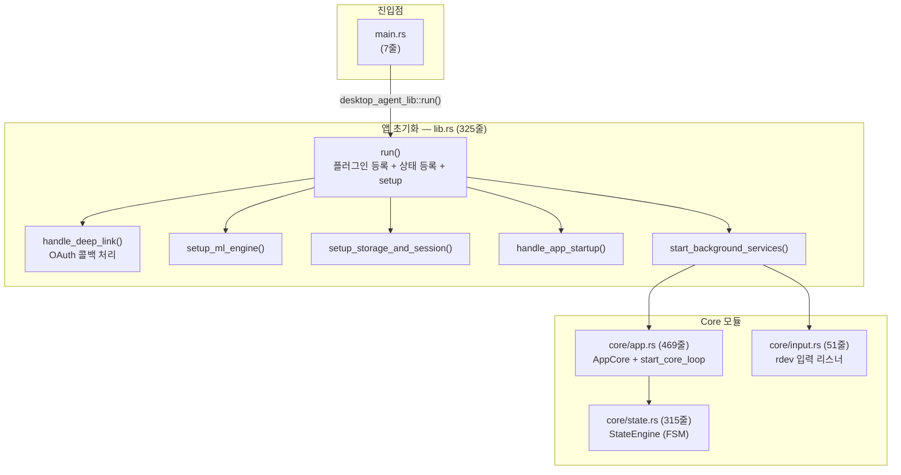
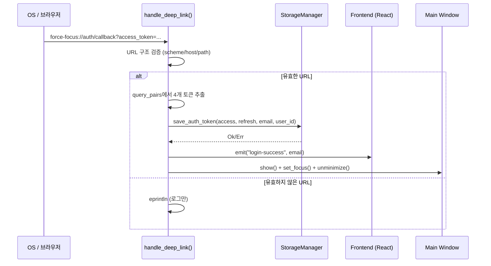
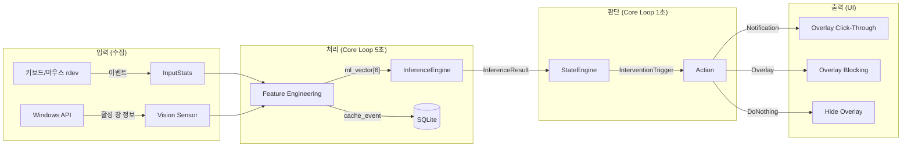

# Core Layer — 코드 리뷰 & 기술 문서

> **범위**: `main.rs`, `lib.rs`, `core/mod.rs`, `core/app.rs`, `core/state.rs`, `core/input.rs`
> **리뷰 일자**: 2026-03-21

---

## 1. 아키텍처 개요



---

## 2. 파일별 상세 리뷰

---

### 2.1 `main.rs` (7줄) — 앱 진입점

```rust
#![cfg_attr(not(debug_assertions), windows_subsystem = "windows")]

fn main() {
    desktop_agent_lib::run()
}
```

| 항목 | 분석 |
|------|------|
| **역할** | Release 빌드 시 콘솔 창 숨김 + `lib.rs`의 `run()` 호출 |
| **`windows_subsystem = "windows"`** | Release에서 콘솔 창이 뜨는 것을 방지. Debug에서만 콘솔 출력 가능 |
| **리뷰 결과** | ✅ 문제 없음. Tauri 표준 패턴 |

---

### 2.2 `lib.rs` (269줄) — 앱 초기화 & 등록 허브

#### 2.2.1 전역 상태 타입 정의 (L23-68)

```rust
pub struct SysinfoState(pub Mutex<System>);                    // 시스템 정보
pub type InputStatsArcMutex = Arc<Mutex<InputStats>>;          // 입력 통계
pub type StateEngineArcMutex = Arc<Mutex<StateEngine>>;        // FSM 엔진
pub type StorageManagerArcMutex = Arc<Mutex<StorageManager>>;  // SQLite
pub type SessionStateArcMutex = Arc<Mutex<Option<ActiveSessionInfo>>>; // 세션
```

| 항목 | 분석 |
|------|------|
| **패턴** | 모든 공유 상태가 `Arc<Mutex<T>>` 래퍼. Tauri의 `.manage()` 시스템과 통합 |
| **메모리 안정성** | ✅ Arc(참조 카운팅) + Mutex(상호 배제)로 스레드 안전 |
| **⚠️ 발견 1** | `SysinfoState`는 일반 `Mutex`(Arc 없음)인 반면, 나머지는 `Arc<Mutex<T>>`. Tauri의 `.manage()`가 내부적으로 `Arc`로 감싸주므로 동작은 하지만, 일관성이 없음. Phase 3에서 `commands/system.rs`로 단일화됨 |
| **⚠️ 발견 2** | `StateEngineArcMutex` 타입이 정의되어 있지만, 실제로는 `lib.rs`에서 `state_engine_manager_state`로 생성하고 `.manage()`에 등록한 뒤 **어디서도 사용하지 않음**. `AppCore` 내부에 별도의 `StateEngine`이 존재 (중복) |

#### 2.2.2 데이터 모델 (L25-53)

| 구조체 | 필드 | 용도 |
|--------|------|------|
| `ActiveSessionInfo` | `session_id`, `task_id`, `start_time_s` | 현재 활성 세션 추적 |
| `Task` | 10개 필드 | 프론트엔드에서 호출하는 태스크 모델 |
| `LoggableEventData<'a>` | `app_name`, `window_title`, `input_stats` | LSN 이벤트 캐싱용 (라이프타임 참조) |

> **⚠️ 발견 3**: `Task` 구조체가 `lib.rs`에 정의되어 있지만 `commands/` 등에서 사용하는 곳이 보이지 않음. `handlers.ts`와 미러링이라면 `types/` 모듈로 분리하는 것이 적절.

> **⚠️ 발견 4**: `LoggableEventData<'a>`에 라이프타임 참조가 사용되었는데, 현재 코드에서 이 구조체를 직접 사용하는 곳이 보이지 않음 (dead code 가능성).

#### 2.2.3 `handle_deep_link()` (L72-131)

**논리 흐름:**


| 항목 | 분석 |
|------|------|
| **보안** | ✅ **FIXED** (커밋 6ecccc6): URL 로그에서 토큰 제거 — scheme/host/path만 출력하도록 수정. 쿼리 파라미터(토큰)는 로그에 노출되지 않음 |
| **에러 처리** | ✅ `try_state`, `match lock()`, `if let Err(e)` 등으로 비교적 안전하게 처리 |
| **성능** | ✅ 일회성 이벤트이므로 성능 이슈 없음 |
| **✅ 발견 5** | **FIXED** (커밋 6ecccc6): 이메일을 `[REDACTED]`로 마스킹 처리 |

#### 2.2.4 `run()` — 메인 빌더 체인 (L133-215)

**초기화 순서:**
```
1. 전역 상태 생성 (InputStats, StateEngine, BackendCommunicator)
2. 플러그인 등록 (autostart, shell, notification, deep-link, opener, single-instance)
3. on_window_event: 닫기 → 숨김 (트레이 모드)
4. .manage(): 상태 등록
5. .setup():
   5-1. setup_ml_engine()      — ONNX 모델 로드
   5-2. setup_storage_and_session() — SQLite + 세션 복원
   5-3. handle_app_startup()   — --silent 인자 체크
   5-4. deep_link.on_open_url()
   5-5. start_background_services() — 코어 루프 + 트레이 + 위젯 + 동기화
6. invoke_handler: 16개 Tauri 커맨드 등록 (Phase 3에서 auth/session/task 분리 반영)
```

| 항목 | 분석 |
|------|------|
| **⚠️ 발견 6** | `commands::system::SysinfoState` 경로 사용. Phase 3에서 `SysinfoState`를 `commands/system.rs`로 단일화하여 해결됨 |
| **⚠️ 발견 7** | L214 `.expect("error while running tauri application")` — 앱 실행 실패 시 패닉. 이는 Tauri 표준 패턴이지만, 에러 메시지가 불친절. 최소한 에러 내용을 포함시켜야 함 |
| **동시성** | L135-137에서 `Arc::new(Mutex::new(...))` 으로 상태 생성 후, `.manage()` + `setup` 클로저에서 사용. 소유권 이동이 명확함 ✅ |

#### 2.2.5 `setup_ml_engine()` (L217-253)

| 항목 | 분석 |
|------|------|
| **⚠️ 발견 8** | 이 함수에서 모델을 로드하고 `app.manage(Mutex::new(engine))`으로 등록하지만, 이후 `start_background_services()` → `AppCore::new()`에서 **다시 모델을 로드함**. 모델이 **두 번 로드**됨 (메모리 낭비 + 불일치 가능성) |
| **에러 처리** | 모델 로드 실패 시 `eprintln`만 하고 계속 진행 ✅ (graceful degradation) |
| **리소스** | `InferenceEngine`은 ONNX 세션을 보유하므로 Drop 시 자동 해제 ✅ |

#### 2.2.6 `setup_storage_and_session()` (L255-269)

| 항목 | 분석 |
|------|------|
| **⚠️ 발견 9** | L258 `.expect("Failed to initialize StorageManager")` — DB 초기화 실패 시 앱 전체가 **패닉**. 파일 권한 문제 등에서 발생 가능. `Result`를 반환하여 상위에서 처리하는 것이 더 안전 |
| **메모리** | `Arc::new(Mutex::new(storage_manager)) as StorageManagerArcMutex` — 타입 캐스트가 명시적. ✅ |

#### 2.2.7 `handle_app_startup()` (L271-286)

| 항목 | 분석 |
|------|------|
| **✅ 발견 10** | **FIXED** (커밋 6ecccc6): `window.show().unwrap()` → `let _ = window.show()` 패턴으로 변경. 다른 곳과 일관성 확보 |

#### 2.2.8 `start_background_services()` (L288-318)

| 항목 | 분석 |
|------|------|
| **⚠️ 발견 11** | L298 `app.manage(std::sync::Mutex::new(AppCore::new(&app_handle)))` — `AppCore`이 `Mutex`로만 래핑됨 (Arc 없음). 이전 상태들은 `Arc<Mutex<T>>` 패턴인데 여기만 다름. Tauri `.manage()` 특성상 동작하지만 일관성 부재 |
| **의존성 순서** | `start_core_loop` → `setup_tray_menu` → `setup_widget_listeners` → `start_sync_loop` → `start_monitor_loop` 순서. 각각 `app_handle.clone()`으로 독립적 참조 ✅ |

#### ~~2.2.9 `greet()` (L321-324)~~ — ✅ 삭제됨

| 항목 | 분석 |
|------|------|
| **✅ 발견 12** | **FIXED** (커밋 6ecccc6): Tauri 템플릿의 `greet` 커맨드 삭제 완료. 프론트엔드 TS 코드에서 미사용 확인 후 제거. CSS의 `#greet-input`은 별도 정리 필요 |

---

### 2.3 `core/mod.rs` (3줄) — 모듈 선언

```rust
pub mod app;
pub mod state;
pub mod input;
```

✅ 단순 모듈 선언. 문제 없음.

---

### 2.4 `core/app.rs` (425줄) — AppCore + 메인 루프

#### 2.4.1 AppCore 구조체 (L22-43)

```rust
pub struct AppCore {
    pub inference_engine: Option<InferenceEngine>,  // ML 엔진 (nullable)
    pub state_engine: StateEngine,                  // FSM
    pub last_event_count: u64,                     // delta 계산용
    pub last_inference_result: InferenceResult,     // 최근 ML 결과
    pub current_event_id: Option<String>,          // 피드백 연결용
    pub global_map: HashMap<String, f64>,          // 글로벌 맵 캐시
    pub delta_history: VecDeque<f64>,              // X_burstiness 계산용 (12틱)
}
```

| 항목 | 분석 |
|------|------|
| **설계** | "중앙 관제소" 패턴 — ML, FSM, 데이터 수집 상태를 단일 구조체에 집중 |
| **⚠️ 발견 13** | 모든 필드가 `pub`으로 노출. 캡슐화 위반. `pub(crate)` 또는 getter/setter 권장 |
| **메모리** | `VecDeque::with_capacity(12)` — 최대 12 요소 제한으로 메모리 사용 예측 가능 ✅ |
| **✅ 발견 14** | **FIXED** (커밋 6ecccc6): `create_dir_all().unwrap()` → `if let Err(e)` 패턴으로 변경. 패닉 방지 |

#### 2.4.2 AppCore::new() (L46-114) — ML 아티팩트 로드

**핵심 동작:**
```
1. AppData 경로 확보 → models/ 디렉토리 생성
2. 번들 리소스 경로 해석
3. [Dev Mode] 무조건 덮어쓰기 / [Release] 없을 때만 복사
4. 글로벌 맵 JSON 로드
5. InferenceEngine 로드 (실패 시 None)
```

| 항목 | 분석 |
|------|------|
| **의사결정** | `#[cfg(debug_assertions)]` 분기로 Dev/Release 동작 구분 — 개발 시 항상 최신 모델 사용하도록 보장. 합리적 결정 ✅ |
| **⚠️ 발견 15** | L68-70, L76-83: `let _ = std::fs::copy(...)` — 파일 복사 실패를 무시. 모델 파일이 없으면 이후 추론이 실패하지만 원인 파악이 어려움 |
| **성능** | 모델 파일 복사는 초기화 시 1회만 발생하므로 문제 없음 ✅ |
| **⚠️ 발견 8 (반복)** | `lib.rs`의 `setup_ml_engine()`에서도 동일한 모델 로드가 이루어짐. **이중 로드로 메모리 낭비** |

#### 2.4.3 `start_core_loop()` (L148-450) — 💥 핵심 루프

**이 함수가 앱의 심장입니다.** 1초 주기 FSM + 5초 주기 센싱을 수행합니다.

```mermaid
graph TB
    subgraph "Core Loop (매 1초 주기)"
        START([매 1초 루프 시작]) --> CHECK_SESSION{세션 활성 여부?}

        %% 세션 활성 경로 (Main Flow)
        CHECK_SESSION -- "활성 (Yes)" --> LOCK_AC[AppCore Lock]
        LOCK_AC --> TICK_ELAPSED[widget-tick: 경과 시간 전송]
        TICK_ELAPSED --> LOCK_IS[InputStats Lock]
        LOCK_IS --> SENSING_FAST[Fast Path: 입력 상태 읽기]
        
        SENSING_FAST --> CHECK_5S{5초 경과?}
        
        %% Slow Path
        CHECK_5S -- "Yes" --> VISION[Vision Sensor: 창 정보 및 시맨틱 태깅]
        VISION --> FEATURE[ML 피처 계산]
        FEATURE --> SAVE_DB[StorageManager: 이벤트 캐싱]
        SAVE_DB --> ML_INFER[InferenceEngine: 추론 실행]
        ML_INFER --> UNLOCK_IS[InputStats Unlock]
        
        CHECK_5S -- "No" --> UNLOCK_IS
        
        UNLOCK_IS --> FSM_PROC[StateEngine: 상태 갱신 및 개입 결정]
        FSM_PROC --> FSM_ACTION{개입 트리거?}
        
        %% 개입 액션
        FSM_ACTION -- "TriggerNotification" --> OVL_NOTIFY[오버레이 표시: Click-through]
        FSM_ACTION -- "TriggerOverlay" --> OVL_BLOCK[오버레이 표시: Blocking]
        FSM_ACTION -- "DoNothing & (Gauge <= 0 OR FOCUS)" --> OVL_HIDE[오버레이 숨김]
        FSM_ACTION -- "기타" --> UNLOCK_AC
        
        OVL_NOTIFY --> UNLOCK_AC
        OVL_BLOCK --> UNLOCK_AC
        OVL_HIDE --> UNLOCK_AC
        
        %% 세션 비활성 경로
        CHECK_SESSION -- "비활성 (No)" --> RESET_LOCK[AppCore Lock]
        RESET_LOCK --> RESET_FSM[FSM manual_reset]
        RESET_FSM --> TICK_0[widget-tick: 0 전송]
        TICK_0 --> UNLOCK_AC

        UNLOCK_AC[AppCore Unlock] --> END([루프 종료/대기])
    end
```



#### 심층 분석

| 카테고리 | 항목 | 분석 |
|----------|------|------|
| **🔴 동시성** | **Mutex 잠금 순서** | AppCore → SessionState → InputStats → StorageManager 순서로 잠금. **항상 동일한 순서를 유지해야 데드락 방지**. 현재는 일관됨 ✅ 단, `hide_overlay`에서 AppCore Lock을 다시 시도하면 데드락 발생 → 이미 코드 주석(L417-418)에서 인지하고 직접 로직으로 대체함 ✅ |
| **🔴 동시성** | **AppCore Lock 범위** | L166에서 Lock을 잡고 L447의 루프 끝까지 유지. **전체 루프 1회 반복 동안 AppCore가 잠김** (최대 1초 + I/O 시간). 다른 스레드에서 AppCore에 접근해야 할 경우 대기 발생 |
| **🟡 성능** | **`thread::sleep(1s)` + 동기 블로킹** | OS 스레드를 점유하며 대기. `tokio` 런타임이 이미 있으므로 `tokio::time::interval`로 변경하면 효율적이지만, 현재 시점에서 병목은 아님 |
| **🟡 성능** | **5초마다 시각 센서 호출** | `_get_active_window_info_internal()` + `_get_all_visible_windows_internal()`는 Windows API 호출. 부하는 경미하지만 동기 호출로 인해 루프 지연 가능 |
| **🟡 메모리** | **불필요한 clone** | L184 `session_guard.clone()` — `ActiveSessionInfo`는 작은 구조체이므로 clone 비용 미미 ✅ |
| **🟡 메모리** | **`input_stats.visible_windows = visible_windows_raw`** (L241) | `Vec<VisibleWindowInfo>`의 소유권 이동 (move). clone이 아니므로 효율적 ✅ |
| **✅ 에러** | **L181 `session_state_mutex.lock().unwrap()`** | **FIXED** (커밋 6ecccc6): `match` 패턴으로 변경. Mutex 오염 시 `continue`로 graceful 처리 |
| **✅ 에러** | **L307 `storage_manager_mutex.lock().unwrap()`** | **FIXED** (커밋 6ecccc6): 동일하게 `match` 패턴 적용 |
| **✅ 에러** | **L198 `input_stats_mutex.lock().unwrap()`** | **FIXED** (커밋 6ecccc6): 동일하게 `match` 패턴 적용 |
| **🟢 설계** | **Fast Path / Slow Path 분리** | 1초 주기(가벼운 상태 체크) / 5초 주기(무거운 센싱 + ML) 분리는 좋은 설계 ✅ |
| **🟢 설계** | **Feature Clipping (L253)** | `(raw_delta as f64).min(50.0)` — 이상치 방지를 위한 Winsorization. ML 입력 안정화 ✅ |

#### 2.4.4 DoNothing 오버레이 숨김 조건 (L428-449)

문서 다이어그램에서 "Gauge ≤ 0"으로 표시되어 있었으나, **실제 구현은 더 넓은 조건**입니다:

```rust
let should_hide = gauge_ratio <= 0.0 
    || state == FSMState::FOCUS;  // FOCUS 상태면 게이지가 29라도 숨김
```

| 조건 | 동작 |
|------|------|
| `gauge_ratio <= 0.0` | 게이지 완전 회복 → 오버레이 숨김 |
| `state == FOCUS` | FOCUS 상태(gauge < 30) → 오버레이 숨김 |
| **데드락 방지** | `commands::window::hide_overlay()` 대신 직접 `window.hide()` 호출 (해당 함수는 AppCore lock을 다시 시도하므로 교착상태 발생) |
| **게이지 보존** | `manual_reset()` 륬호출 — 자연 회복 시 게이지를 0으로 초기화하지 않음 |

#### 2.4.5 `raw_json` 학습용 데이터 (L328-333)

> `app.rs:328`에서 `raw_json` 변수가 생성되지만 **실제로 사용되지 않습니다** (`unused variable` 컴파일러 경고).
> `activity_vector_json` (세탁된 버전)이 실제로 LSN에 저장됩니다.

```rust
// 생성되지만 사용되지 않는 변수 (데드코드)
let raw_json = serde_json::json!({
    "delta_events": raw_delta,      // 원본 delta
    "silence_sec": silence_sec,
    "window_title": window_info.title, // ⚠️ 원본 창 제목 (개인정보 포함 가능)
    "ml_vector": ml_vector
});

// 실제로 LSN에 저장되는 데이터 (세탁된 버전)
storage.cache_event(
    &session_id, &client_evt_id, 
    &window_info.app_name,
    &sanitized_active_title,  // 시맨틱 필터 적용된 제목
    &activity_vector_json,    // InputStats의 JSON 직렬화
);
```

#### 2.4.4 `ensure_overlay_exists()` (L452-469)

| 항목 | 분석 |
|------|------|
| **역할** | 오버레이 창이 없으면 동적 생성 (fullscreen, always_on_top, transparent) |
| **⚠️ 발견 16** | `.build().ok()` — 창 생성 실패 시 에러를 무시. 최소한 로그 필요 |

---

### 2.5 `core/state.rs` (271줄) — FSM 상태 엔진

#### 2.5.1 설계 (시간 기반 적분 제어)

```
게이지 모델:
  drift_gauge += dt × multiplier

  multiplier 결정:
    StrongOutlier  → +1.0 (실시간)
    WeakOutlier    → +0.5 (시간 지연)
       + Safety Net (마우스 활동 & 입력 없음) → ×0.5 = 0.25
    Inlier         → -2.0 (빠른 회복)

  상태 전이:
    gauge < 30  → FOCUS
    30 ≤ gauge < 60 → DRIFT → TriggerNotification
    gauge ≥ 60 → DISTRACTED → TriggerOverlay

  스누즈: 마지막 개입 후 10초간 재알림 억제
```

| 항목 | 분석 |
|------|------|
| **설계** | 시간 적분 기반 게이지 시스템은 전형적인 "leaky bucket" 패턴. 급격한 상태 변화를 방지하고 점진적 에스컬레이션 지원 ✅ |
| **메모리** | 4개 필드 (`f64` × 2, `u64` × 1, `FSMState` enum) = ~32바이트. 매우 경량 ✅ |
| **⚠️ 발견 17** | L78 `self.drift_gauge`에 상한이 없음. `THRESHOLD_BLOCK_SEC`(60.0) 이상으로도 무한 증가 가능. Inlier 복귀 시 과도한 회복 시간 필요. `.min(THRESHOLD_BLOCK_SEC + BUFFER)` 상한 적용 권장 |
| **✅ 발견 18** | **FIXED** (커밋 6ecccc6): `FSMState`에 `Copy` 트레이트 추가. `.clone()` 대신 값 복사 가능 |
| **🟢 테스트** | 6개 테스트 케이스가 잘 작성됨. ✅ Strong/Weak accumulation, Safety Net, Fast Recovery, Snooze, DISTRACTED→FOCUS 복귀까지 커버 |

#### 2.5.2 `calculate_multiplier()` (L93-122) — 핵심 로직

```
StrongOutlier → 1.0 (급박한 이탈, 실시간 속도)
WeakOutlier   → 0.5 (불확실한 이탈, 느리게 축적)
  + Safety Net: !has_recent_input && is_mouse_active → ×0.5 → 0.25
Inlier        → -2.0 (업무 복귀, 빠른 회복)
```

| 항목 | 분석 |
|------|------|
| **의사결정** | Safety Net의 "마우스만 움직이고 키 입력 없음" → "적극적으로 생각 중일 수 있다" 해석은 합리적 |
| **⚠️ 발견 19** | Safety Net이 `WeakOutlier`에만 적용됨. `StrongOutlier`에서도 마우스가 활발히 움직이면 (예: 문서를 읽고 있으면) 속도를 줄여야 하는지 검토 필요 |

---

### 2.6 `core/input.rs` (49줄) — 입력 리스너

```rust
pub fn start_input_listener(input_stats_arc_mutex: InputStatsArcMutex) {
    thread::spawn(move || {
        listen(move |event| {
            match event.event_type {
                KeyPress | ButtonPress | Wheel → update_meaningful_stats()
                MouseMove → update_mouse_move_stats()
                _ → ()
            }
        })
    });
}
```

| 항목 | 분석 |
|------|------|
| **설계** | rdev의 글로벌 입력 후킹을 별도 스레드에서 실행. 이벤트를 "유의미한 입력"과 "마우스 이동"으로 분류 ✅ |
| **동시성** | 콜백 내부에서 `input_stats_arc_mutex.lock()` — 매 이벤트마다 Mutex Lock 발생 |
| **🟡 성능** | 마우스는 초당 수백~수천 이벤트 발생. 매번 Lock을 잡으므로 **경합(contention)** 가능. 그러나 Lock 내부 작업이 경량(타임스탬프 갱신, 카운터 증가)이므로 실질적 병목은 낮음 |
| **⚠️ 발견 20** | L11 `listen()` 실패 시 `eprintln`만 출력하고 스레드가 종료됨. 앱은 이를 인지하지 못함 (입력 모니터링이 죽어도 계속 돌아감). 재시작 로직이나 상태 플래그 필요 |
| **⚠️ 발견 21** | `KeyRelease`, `ButtonRelease` 이벤트는 무시 (`_ =>`)되므로 중복 카운팅 없음 ✅ |
| **메모리** | `Arc<Mutex<InputStats>>`를 클로저로 move. 참조 카운팅으로 수명 관리 ✅ |

---

## 3. 발견 사항 요약

### 🔴 높은 우선순위 (Blocking)

| # | 파일 | 라인 | 이슈 | 상태 |
|---|------|------|------|------|
| 5 | lib.rs | 73, 89 | **보안**: Deep Link URL 및 이메일 로그 노출 | ✅ FIXED (6ecccc6) |
| 8 | lib.rs + app.rs | 여러 줄 | ML 모델 **두 번 로드** (크로스 모듈) | ⏳ 전체 리뷰 후 수정 |
| — | app.rs | 181, 198, 307 | `lock().unwrap()` 패닉 위험 | ✅ FIXED (6ecccc6) |

### 🟡 중간 우선순위 (Important)

| # | 파일 | 라인 | 이슈 | 상태 |
|---|------|------|------|------|
| 2 | lib.rs | 62 | `StateEngineArcMutex` dead state (크로스 모듈) | ⏳ 전체 리뷰 후 수정 |
| 9 | lib.rs | 258 | StorageManager `.expect()` 패닉 | ⏳ 미수정 |
| 10 | lib.rs | 281-282 | `window.show/set_focus().unwrap()` 패닉 | ✅ FIXED (6ecccc6) |
| 17 | state.rs | 78 | drift_gauge 상한 제한 없음 | ✅ FIXED |
| 20 | input.rs | 11-33 | 입력 리스너 실패 시 복구 없음 | ✅ FIXED |

### 🟢 낮은 우선순위 (Minor / 개선 사항)

| # | 파일 | 이슈 | 상태 |
|---|------|------|------|
| 1 | lib.rs | `SysinfoState` Arc 패턴 불일관 | ⏳ |
| 3, 4 | lib.rs | `Task`, `LoggableEventData` dead code 가능성 | ⏳ |
| 6 | lib.rs | `commands::system::SysinfoState` 경로 혼란 | ✅ FIXED (Phase 3: 단일화) |
| 12 | lib.rs | `greet()` 템플릿 코드 잔류 | ✅ FIXED (6ecccc6) |
| 13 | app.rs | 모든 필드 `pub` 노출 | ⏳ |
| 14 | app.rs | `create_dir_all().unwrap()` 패닉 | ✅ FIXED (6ecccc6) |
| 18 | state.rs | `FSMState`에 `Copy` 트레이트 미적용 | ✅ FIXED (6ecccc6) |

---

## 4. 데이터 흐름 요약


