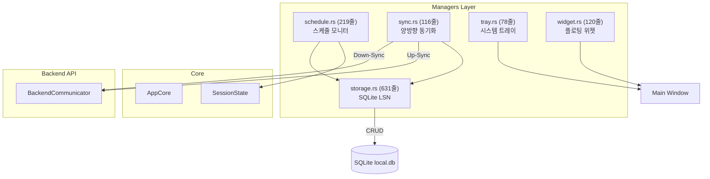
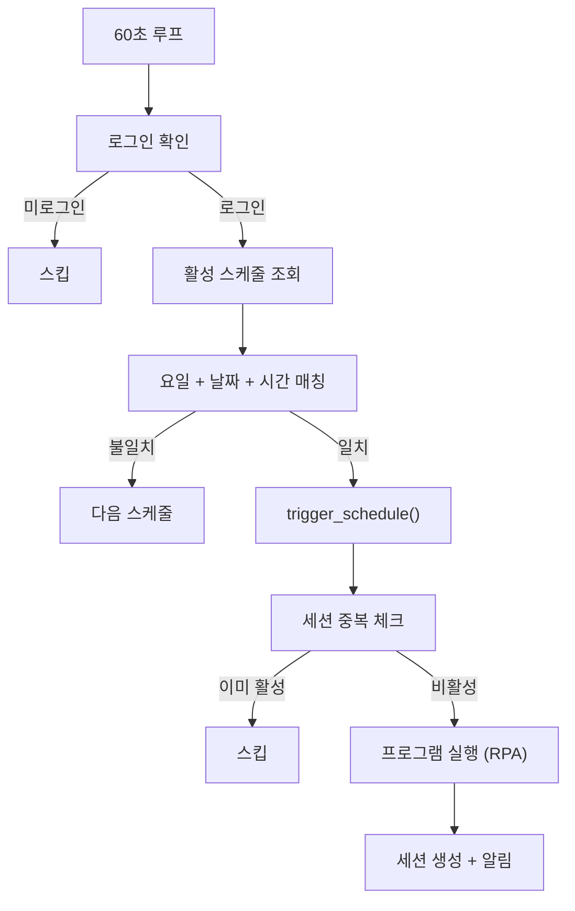

# Managers Layer — 코드 리뷰 & 기술 문서

> **범위**: `managers/mod.rs`, `managers/storage.rs`, `managers/schedule.rs`, `managers/sync.rs`, `managers/tray.rs`, `managers/widget.rs`
> **리뷰 일자**: 2026-03-21

---

## 1. 아키텍처 개요



**역할**: Core Loop 외부에서 동작하는 **주변 서비스**. 데이터 영속화(Storage), 서버 동기화(Sync), 자동 스케줄(Schedule), UI 보조(Tray/Widget).

---

## 2. 파일별 상세 리뷰

---

### 2.1 `managers/mod.rs` (5줄)

✅ 단순 모듈 선언.

---

### 2.2 `managers/storage.rs` (631줄) — 💥 SQLite 로컬 스토리지

**이 파일은 프로젝트에서 가장 큰 단일 파일입니다.**

#### DB 스키마 (6 테이블)

| 테이블 | 역할 | PK |
|--------|------|-----|
| `active_session` | 현재 활성 세션 (1행 최대) | `session_id` |
| `cached_events` | 센싱 이벤트 캐시 (Up-Sync 대기) | `id` (AUTO) |
| `cached_feedback` | 사용자 피드백 캐시 | `id` (AUTO) |
| `auth_token` | 인증 토큰 (1행 고정, `id=1` CHECK) | `id` |
| `schedules` | 스케줄 (Down-Sync) | `id` |
| `tasks` | 태스크 (Down-Sync) | `id` |

#### 심층 분석

| 카테고리 | 분석 |
|----------|------|
| **🟢 에러** | 대부분 `.map_err(\|e\| e.to_string())?` 패턴으로 일관되게 에러 처리 ✅ |
| **✅ 에러** | L418 `SystemTime::now().duration_since(UNIX_EPOCH).unwrap()` — **FIXED** (c7c6741): `unwrap_or_default()` |
| **🟢 동시성** | 내부 `Mutex<Connection>` — 각 메서드에서 `self.conn.lock().map_err()?`로 안전하게 접근 ✅ |
| **🟢 트랜잭션** | `delete_events_by_ids`, `delete_feedbacks_by_ids`, `sync_schedules`, `sync_tasks` — 트랜잭션 사용 ✅ |
| **✅ 보안** | `auth_token` 보안: XOR Obfuscation 계층 적용됨 (FIXED). 아래 상세 참조 |
| **🟢 마이그레이션** | L188 `ALTER TABLE schedules ADD COLUMN start_date` — 실패 시 무시(`let _ =`). 기존 DB 호환성 ✅ |
| **🟢 테스트** | 3개 테스트 (session CRUD, cache_event) ✅. 인메모리 DB 사용 |

#### XOR Obfuscation — 토큰 보안 계층 (L479-498)

> OS keyring의 불안정성(Windows 자격 증명 관리자 증발 문제)으로 인해, 
> keyring 의존성을 제거하고 SQLite 내 **XOR 난독화** 계층으로 대체했습니다.

**알고리즘:**
```
저장 (save_auth_token):
  raw_token → XOR(byte, key[i % key_len]) → HEX 문자열 → DB INSERT

로드 (load_auth_token):
  DB SELECT → HEX 문자열 → 바이트 변환 → XOR(byte, key[i % key_len]) → raw_token
```

**구현 상세:**

| 항목 | 값 |
|------|----|
| **XOR 키** | `b"force-focus-secret-key-2026-secure-vault"` (하드코딩) |
| **인코딩** | 각 바이트를 `{:02x}` 포맷으로 HEX 문자열 변환 |
| **디코딩** | 2글자씩 읽어 `u8::from_str_radix(hex, 16)` → XOR 복원 |
| **오류 시** | `String::from_utf8(...).unwrap_or_default()` — 깨진 데이터 시 빈 문자열 반환 |

**하위 호환 로직 (`load_auth_token` L454-467):**

```rust
// 1. 레거시 keyring 엔트리 감지
if db_access == "keyring" → return Ok(None)

// 2. 평문 vs 인코딩 자동 감지
let is_obfuscated = db_access.len() % 2 == 0 
    && db_access.chars().all(|c| c.is_ascii_hexdigit());

// 3. 조건부 디코딩
let final_access = if is_obfuscated { xor_deobfuscate() } else { db_access };
```

> ⚠️ **보안 한계**: XOR 난독화는 **암호화가 아닙니다**. 키가 바이너리에 하드코딩되어 있으므로 리버스 엔지니어링으로 복원 가능합니다. 그러나 평문 저장 대비 casual inspection 방지 효과가 있으며, OS keyring보다 **안정적**입니다.

---

### 2.3 `managers/schedule.rs` (219줄) — 스케줄 모니터

#### 동작 흐름



#### 심층 분석

| 카테고리 | 분석 |
|----------|------|
| **✅ 로직** | L135-148 **FIXED** (커밋 c7c6741): `cmd.spawn()`으로 변경하여 인자가 적용된 Command로 실행 |
| **✅ 에러** | L159-162 `SystemTime::now().duration_since(UNIX_EPOCH).unwrap()` — **FIXED** (c7c6741): `unwrap_or_default()` |
| **🟡 보안** | L131-148 `Command::new(&exe_path)` — DB에서 가져온 경로로 **임의 프로그램 실행**. 경로 검증 없음 (DB 변조 시 악용 가능) |
| **🟢 동시성** | Mutex Lock 스코프가 `{ }` 블록으로 최소화됨 ✅ |
| **🟢 설계** | 세션 중복 방지 로직 ✅, OS 네이티브 알림 연동 ✅ |

---

### 2.4 `managers/sync.rs` (116줄) — 양방향 동기화

#### 동기화 패턴

| 방향 | 데이터 | 주기 |
|------|--------|------|
| **Down-Sync** | Tasks, Schedules | 60초 |
| **Up-Sync** | Cached Events (50/batch) | 60초 |
| **Up-Sync** | Cached Feedbacks (50/batch) | 60초 |

#### 심층 분석

| 카테고리 | 분석 |
|----------|------|
| **🟢 설계** | Lock-Read-Unlock → API Call → Lock-Delete 패턴. API 호출 중 Lock을 잡지 않음 ✅ |
| **🟢 에러** | Down-Sync 실패 시 `eprintln`만 하고 진행 (graceful) ✅ |
| **🟡 성능** | `delete_events_by_ids` — 개별 DELETE 반복 (트랜잭션이지만). 대량 삭제 시 `WHERE id IN (...)` 더 효율적 |
| **🟡 설계** | L124 `DateTime::from_timestamp(...).unwrap_or(Utc::now())` — 타임스탬프 변환 실패 시 현재 시간 대체. 데이터 정확도 저하 가능 |

---

### 2.5 `managers/tray.rs` (78줄) — 시스템 트레이

#### 심층 분석

| 카테고리 | 분석 |
|----------|------|
| **🟢 설계** | 더블클릭 방지용 쿨다운(200ms) ✅. `Arc<Mutex<Instant>>` 사용 |
| **🟡 에러** | L25 `app.default_window_icon().unwrap()` — 아이콘 누락 시 **패닉** |
| **✅ 에러** | L56 `last_click_clone.lock().unwrap()` — **FIXED** (c7c6741): `match` 패턴 |
| **🟢 UI** | 왼쪽 클릭=토글, 오른쪽 클릭=메뉴. `let _ =` 패턴으로 안전한 윈도우 조작 ✅ |

---

### 2.6 `managers/widget.rs` (120줄) — 플로팅 위젯

#### 심층 분석

| 카테고리 | 분석 |
|----------|------|
| **🟢 설계** | 포커스 복원 노이즈 방지(200ms 쿨다운) ✅. Get-or-Create 패턴 ✅ |
| **🟡 설계** | 동적 위치 계산 — 모니터 감지 실패 시 FHD 기본값(1680, 20) 사용. 기본값이 잘못된 해상도에서 위젯이 보이지 않을 수 있음 |
| **✅ 에러** | L12 `get_webview_window("main").unwrap()` — **FIXED** (c7c6741): `match` 패턴 |
| **✅ 에러** | L24, L27, L48 `lock().unwrap()` — **FIXED** (c7c6741): `match` 패턴 (3곳) |
| **🟡 에러** | L75 `"http://localhost:1420/widget.html".parse().unwrap()` — URL 파싱은 안전하지만 형식적 unwrap |

---

## 3. 발견 사항 요약

### 🔴 높은 우선순위

| # | 파일 | 라인 | 이슈 | 상태 |
|---|------|------|------|------|
| M-1 | schedule.rs | 135, 148 | Command 이중 생성 버그 | ✅ FIXED (c7c6741) |
| M-2 | storage.rs | 418 | `unwrap()` 패닉 | ✅ FIXED (c7c6741) |
| M-3 | widget.rs | 12 | `unwrap()` 패닉 | ✅ FIXED (c7c6741) |
| M-4 | widget.rs | 24, 27, 48 | `lock().unwrap()` 3곳 | ✅ FIXED (c7c6741) |
| M-5 | tray.rs | 56 | `lock().unwrap()` | ✅ FIXED (c7c6741) |

### 🟡 중간 우선순위

| # | 파일 | 이슈 | 상태 |
|---|------|------|------|
| M-6 | schedule.rs | 159-162 `unwrap()` 시간 패닉 | ✅ FIXED (c7c6741) |
| M-7 | storage.rs | auth_token 평문 저장 → XOR Obfuscation 적용 | ✅ FIXED |
| M-8 | tray.rs | L25 `default_window_icon().unwrap()` | ✅ FIXED |
| M-9 | widget.rs | 모니터 감지 실패 시 기본값 문제 | ✅ FIXED |

### 🟢 낮은 우선순위

| # | 파일 | 이슈 |
|---|------|------|
| M-10 | sync.rs | 개별 DELETE 비효율 (IN절 권장) |
| M-11 | sync.rs | timestamp 변환 실패 시 현재 시간 대체 |
