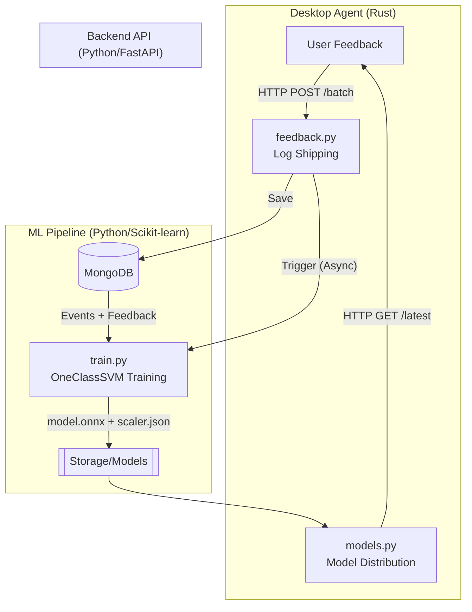
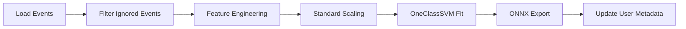

# ML Personalization — 서버측 재학습 파이프라인
 
> **범위**: `backend/app/api/endpoints/desktop/feedback.py`, `backend/app/api/endpoints/desktop/models.py`, `backend/app/ml/train.py`
> **리뷰 일자**: 2026-04-01
 
---
 
## 1. 아키텍처 개요 — Closed-Loop 로컬 학습 시스템
 
사용자의 피드백을 수집하여 개인화된 ONNX 모델을 생성하고, 다시 데스크톱 에이전트로 배포하는 전체 사이클입니다.
 

 
**개인화 학습 핵심 지표:**
 
| 단계 | 설명 | 데이터 형식 |
|-------|---------|-----------|
| **수집** | 데스크톱 에이전트의 이탈 무시(distraction_ignored) 로그 수집 | MongoDB `user_feedback` |
| **필터링** | 학습 데이터에서 사용자가 "업무"라고 명시한 구간을 강화 | `X_context` 가중치 부여 |
| **학습** | OneClassSVM (RBF Kernel)을 통한 사용자별 경계 학습 | `nu=0.05`, `gamma='scale'` |
| **배포** | 학습 완료된 모델을 ONNX 포맷으로 변환하여 서빙 | `model.onnx`, `scaler_params.json` |
 
---
 
## 2. 파일별 상세 리뷰
 
---
 
### 2.1 `api/endpoints/desktop/feedback.py` — 피처 로그 수동 수집
 
데스크톱 에이전트에서 보낸 피드백 로그를 수신하고 학습을 트리거하는 진입점입니다.
 
| 항목 | 내용 |
|------|------|
| **역할** | 배치 피드백 저장 + 백그라운드 학습 스케줄링 |
| **`receive_feedback_batch()`** | `BackgroundTasks`를 사용하여 응답 지연 없이 학습 실행 |
| **트리거 정책** | 피드백이 1개라도 수신되면 즉시 `train_user_model` 호출 |
 
> **🟡 안전성**: MongoDB 연결 실패 시 500 에러를 반환하지만, `BackgroundTasks` 내부에서 발생하는 예외는 클라이언트가 알 수 없음. 별도의 작업 상태 추적 권장.
 
---
 
### 2.2 `ml/train.py` — 💥 개인화 모델 학습 엔진
 
사용자 데이터를 기반으로 `StandardScaler`와 `OneClassSVM` 모델을 생성합니다.
 
#### 학습 프로세스 요약
 

 
#### 심층 분석 (데스크톱 로직과의 일관성)
 
| 카테고리 | 분석 |
|----------|------|
| **🟢 일관성** | **Feature Engineering** — `X_context`, `X_log_input`, `X_silence`, `X_burstiness`, `X_mouse`, `X_interaction` 6종 피처 계산 로직이 데스크톱(Rust)과 수학적으로 동일하게 구현됨 ✅ |
| **🟢 설계** | **Weighted Training** — `X_context` 점수가 높은 데이터에 가중치를 부여(`sigmoid` 기반)하여 Positive 샘플의 중요도를 높임 ✅ |
| **🟢 효율성** | **skl2onnx** — Scikit-learn 모델을 `initial_type = [('float_input', FloatTensorType([None, 6]))]` 포맷의 ONNX로 변환하여 데스크톱 에이전트에서 즉시 사용 가능하도록 설계됨 ✅ |
| **🟡 데이터** | 현재 `len(events) < 50`일 경우 학습을 스킵함. 콜드 스타트 사용자를 위한 Grund-Truth 기반 기본 모델 제공 전략 필요 |
 
---
 
### 2.3 `api/endpoints/desktop/models.py` — 모델 배포 서비스
 
학습된 모델 파일을 버전별로 관리하고 배포합니다.
 
| 항목 | 내용 |
|------|------|
| **버전 관리** | `YYYYMMDDHHMMSS` 포맷의 디렉토리 구조 사용 (정렬 시 최신순) |
| **보안** | `download_model_file`에서 파일명을 `model.onnx`, `scaler_params.json`으로 제한하여 Path Traversal 방지 ✅ |
| **데이터 정합성** | ONNX 파일과 Scaler JSON 파일이 모두 존재할 때만 성공 응답 반환 ✅ |
 
---
 
## 3. 발견 사항 요약
 
### 🔴 높은 우선순위
 
| # | 이슈 | 설명 |
|---|------|------|
| **S-1** | **재학습 빈도 과잉** | 현재 피드백 1개당 전체 재학습이 일어남. 사용자 증가 시 서버 부하 급증 가능성. `Threshold-based trigger` (예: 피드백 10개 누적 시) 도입 권장 |
| **S-2** | **동기 작업 점유** | `train_user_model`이 CPU 집약적인 Pandas/Scikit-learn 작업을 수행하므로, FastAPI 워커 스레드 점유 위험. 별도의 워커(Celery/RQ) 분리 고려 |
 
### 🟡 중간 우선순위
 
| # | 이슈 | 설명 |
|---|------|------|
| **S-3** | **Global Map 중복** | `GLOBAL_MAP` 하드코딩이 데스크톱(`global_map.json`)과 별도로 서버 코드에도 존재. 모델 업데이트 시 양쪽 불일치 위험 |
| **S-4** | **에러 격리** | 백그라운드 학습 실패 시 에러 로그 외에 사용자에게 알릴 수 있는 수단(API) 부재 |
 
---
 
## 4. 핵심 의사결정 기록
 
### 0.5배속 가중치와 Feedback 연동
 
| 항목 | 내용 |
|------|------|
| **의도** | 사용자가 이탈 알림을 무시(`distraction_ignored`)했다는 것은, 현재 행위가 "예외적인 업무"임을 의미 |
| **구현** | `train.py`에서 해당 이벤트 ID를 제외하고 재학습함으로써 모델의 Decision Boundary를 사용자 맞춤형으로 확장 |
| **결과** | 동일한 상황(동일 앱, 유사 입력 패턴) 발생 시 AI가 더 이상 'Outlier'로 판정하지 않게 됨 (개인화 최적화) |
