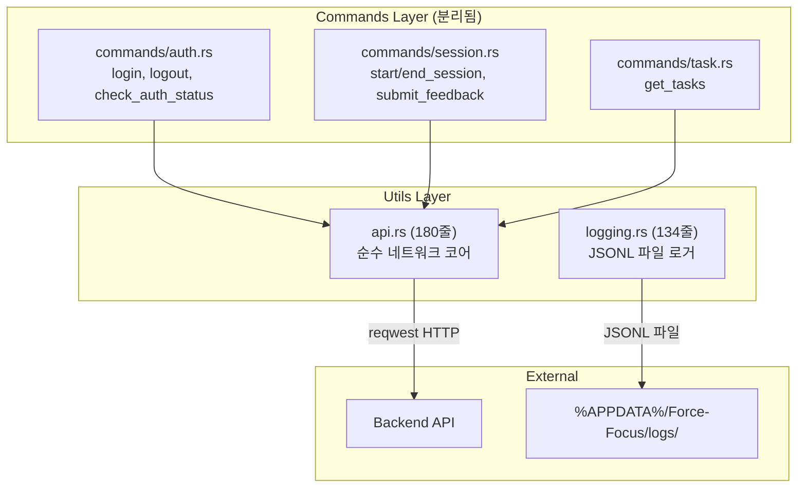

# Utils Layer — 코드 리뷰 & 기술 문서

> **범위**: `utils/mod.rs`, `utils/api.rs`, `utils/logging.rs`
> **리뷰 일자**: 2026-03-21
> **최종 업데이트**: 2026-04-12 (모듈 분리 반영)

---

## 1. 아키텍처 개요

> ⚠️ (커밋 `fe89e11`)에서 826줄짜리 `backend_comm.rs`가 4개 파일로 분리되었습니다.



**역할**: `api.rs`는 HTTP 클라이언트 + DTO 정의 (순수 네트워크 계층). Tauri 커맨드는 `commands/` 모듈로 분리. `logging.rs`는 활동 데이터를 JSONL 파일로 기록.

---

## 2. 파일별 상세 리뷰

---

### 2.1 `utils/mod.rs` (2줄)

```rust
pub mod api;
pub mod logging;
```

✅ 단순 모듈 선언. `backend_comm` → `api`로 변경됨.

---

### 2.2 `utils/api.rs` (194줄) — 순수 네트워크 코어

> Phase 3에서 `backend_comm.rs`의 HTTP 클라이언트 + DTO를 분리한 파일.
> Tauri 커맨드 핸들러(`#[command]`)는 포함하지 않음 — 순수 네트워크 계층.

#### 구조 요약

| 구분 | 항목 |
|------|------|
| **URL 설정** | `get_api_base_url()` — 빌드 시 주입(`option_env!`) > .env > 기본값 |
| **클라이언트** | `BackendCommunicator` — `reqwest::Client` 래퍼 |
| **API 메서드** | `check_latest_model_version`, `download_file`, `send_feedback_batch`, `sync_events_batch`, `fetch_tasks`, `fetch_schedules` |
| **DTO 구조체** | `FeedbackPayload`, `SessionStartRequest`, `SessionEndRequest`, `EventBatchRequest`, `EventData`, `ApiTask`, `ApiSchedule`, `ModelVersionResponse`, `ModelDownloadUrls` |

#### URL 우선순위

```
1. option_env!("API_BASE_URL")    ← 빌드 시 환경 변수 (CI/CD)
2. dotenv().ok() → env::var()     ← .env 파일 (로컬 개발)
3. "http://127.0.0.1:8000/api/v1" ← 기본값 (fallback)
```

#### 핵심 설계 패턴: Offline-First

```
1. UI 즉시 반응 (Lock → Local DB 업데이트 → Lock 해제)
2. 백그라운드 서버 동기화 (tokio::spawn → API 호출)
3. 실패 시 다음 주기에 재시도 (graceful degradation)
```

#### 심층 분석

| 카테고리 | 분석 |
|----------|------|
| **🟢 에러** | 대부분 `.map_err()` 패턴 일관 적용 ✅. 서버 에러 시 상태 코드 + 본문 포함 에러 반환 |
| **🟢 설계** | `download_file()` — `bytes_stream()` + `write_all` 청크 방식으로 메모리 효율적 ✅ |
| **🟢 분리** | DTO 구조체가 `api.rs`에 집중되어 커맨드 핸들러(`commands/`)와 깔끔하게 분리됨 ✅ |

---

### 2.3 분리된 커맨드 모듈 (`commands/auth.rs`, `session.rs`, `task.rs`)

> Phase 3에서 `backend_comm.rs`의 10개 Tauri 커맨드 중 8개가 `commands/` 모듈로 분리.

| 파일 | 커맨드 | 역할 |
|------|--------|------|
| `commands/auth.rs` | `login` | OAuth 시스템 브라우저 방식. StorageManager에 토큰 저장 |
| | `logout` | LSN 토큰 삭제 + BackendCommunicator 서버 알림 (spawn) |
| | `check_auth_status` | LSN에서 토큰 로드 → 이메일 반환 (자동 로그인용) |
| `commands/session.rs` | `start_session` | Offline-First: 로컬 세션 생성 → spawn(서버 동기화) |
| | `end_session` | 로컬 세션 삭제 + 오버레이 숨김 + spawn(서버 알림) |
| | `submit_feedback` | FSM 즉시 리셋 → 피드백 LSN 캐시 → spawn(서버 전송) |
| | `get_current_session_info` | 타이머 위젯 동기화용 PULL API |
| `commands/task.rs` | `get_tasks` | LSN에서 로컬 Task 목록 조회 (Down-Sync된 데이터) |

#### 심층 분석

| 카테고리 | 분석 |
|----------|------|
| **🟢 동시성** | Lock 범위를 `{ }` 블록으로 최소화 → API 호출 중 Lock 미보유 ✅ |
| **🟢 설계** | `submit_feedback`: FSM 즉시 리셋 → Local Cache → 백그라운드 전송. 우수한 UX 설계 ✅ |
| **🟢 비동기** | `start_session`/`end_session` — 동기 Lock + 비동기 spawn 분리 ✅ |
| **🟢 보안** | `login`/`check_auth_status` 로그에서 이메일 `[REDACTED]`로 마스킹 ✅ |

---

### 2.4 `utils/logging.rs` (118줄) — 활동 로거

#### 동작

```
별도 스레드 → interval_secs마다 반복:
  1. 활성 창 정보 수집
  2. InputStats 읽기 (lock → clone)
  3. JSONL 형식으로 %APPDATA%/Force-Focus/logs/YYYY-MM-DD.jsonl에 추가
```

#### 심층 분석

| 카테고리 | 분석 |
|----------|------|
| **🟢 에러** | Mutex lock 실패 시 `eprintln` + 계속 진행 ✅ |
| **🟢 에러** | 파일/디렉토리 생성 실패 시 조기 반환 ✅ |
| **🟡 설계** | 로그 파일 크기 제한 없음 — 장기간 실행 시 디스크 공간 문제 |
| **🟡 설계** | `get_log_dir()` — `%APPDATA%` 직접 사용. Tauri의 `app_data_dir()` 미사용 (다른 모듈과 경로 불일치) |
| **🟡 보안** | 활성 창 제목(window_title)이 파일에 기록 — 민감 정보 포함 가능 |
| **🟢 성능** | 별도 스레드에서 동작하므로 메인 루프에 영향 없음 ✅ |

---

## 3. 발견 사항 요약

### 🟡 중간 우선순위

| # | 파일 | 이슈 | 상태 |
|---|------|------|------|
| U-1 | backend_comm.rs | L422, L768 이메일 콘솔 노출 | ✅ FIXED (80db381) |
| U-2 | backend_comm.rs | `download_latest_model()` dead code | ✅ FIXED (삭제됨) |
| U-3 | backend_comm.rs | 826줄 단일 파일 — 분리 권장 | ✅ FIXED (api.rs + auth/session/task.rs 분리, fe89e11) |
| U-4 | logging.rs | 로그 파일 크기 무제한 | ✅ FIXED |
| U-5 | logging.rs | `%APPDATA%` 직접 사용 (Tauri 불일치) | ✅ FIXED |

### 🟢 낮은 우선순위

| # | 파일 | 이슈 |
|---|------|------|
| U-6 | logging.rs | 활성 창 제목 평문 기록 (보안) |
