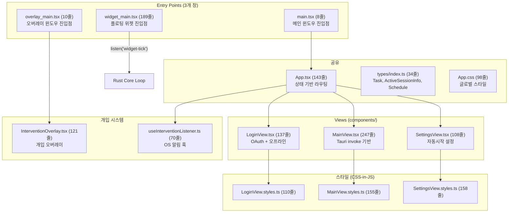

# Frontend Layer — 코드 리뷰 & 기술 문서

> **범위**: `src/` 디렉토리 전체 (React 18 / TypeScript)
> **리뷰 일자**: 2026-03-21
> **최종 업데이트**: 2026-04-19 (Phase 4 MSW 제거 + 스타일 분리 반영)

---

## 1. 아키텍처 개요



> ✅ Phase 4에서 MSW 프로토타입(`api/index.ts`, `mocks/`, `MainView/index.tsx` + 4개 서브컴포넌트)이 모두 삭제되었습니다.
> 현재 **모든 View가 Tauri `invoke`/`listen` 기반**으로 통일되어 있습니다.

### 멀티 윈도우 아키텍처

| 윈도우 | 진입점 | 역할 |
|--------|--------|------|
| **메인** (main) | `main.tsx` → `App.tsx` | 로그인/대시보드/설정 |
| **오버레이** (overlay) | `overlay_main.tsx` → `InterventionOverlay` | 개입 알림/차단 |
| **위젯** (widget) | `widget_main.tsx` → `WidgetApp` | 플로팅 타이머 |

---

## 2. 파일별 상세 리뷰

---

### 2.1 `main.tsx` (8줄) — 메인 윈도우 진입점

```tsx
ReactDOM.createRoot(document.getElementById("root")).render(
  <React.StrictMode><App /></React.StrictMode>
);
```

✅ Phase 4에서 MSW 주석 코드(33줄) 제거됨. 깔끔한 상태.

---

### 2.2 `overlay_main.tsx` (10줄) — 오버레이 윈도우 진입점

| 카테고리 | 분석 |
|----------|------|
| **🟢 설계** | 오버레이 전용 React 앱. `InterventionOverlay` 단일 컴포넌트 렌더링 ✅ |
| **🟡 설계** | 전용 CSS import 주석 처리됨 (`// import './overlay.css'`). 필요 시 활성화 |

---

### 2.3 `widget_main.tsx` (189줄) — 플로팅 위젯 (타이머)

> 독립 React 앱. Rust의 `widget-tick` 이벤트를 **PUSH 수신**하여 타이머를 표시합니다.

| 카테고리 | 분석 |
|----------|------|
| **🟢 설계** | Rust Core Loop에서 1초마다 `widget-tick` 이벤트를 PUSH → 프론트엔드는 수신만 담당. PULL 로직 제거됨 ✅ |
| **🟢 UX** | FOCUSING 상태 인디케이터 (왼쪽 초록 테두리) + Pill 형태 종료 버튼 ✅ |
| **🟢 에러** | listener setup 실패 시 `setError()` + UI 표시 ✅ |
| **🟢 정리** | 이벤트 리스너 `unlisten` 클린업 정상 ✅ |
| **🟡 설계** | 인라인 스타일 사용 (styles 파일 미분리). 다른 View와 패턴 불일치 |

---

### 2.4 `App.tsx` (143줄) — 앱 루트

| 카테고리 | 분석 |
|----------|------|
| **🟢 설계** | 상태 기반 라우팅 (`login` / `main` / `settings`). 단순하고 명확 ✅ |
| **🟢 에러** | 자동 로그인 실패 시 `login` 뷰로 fallback ✅ |
| **🟡 보안** | L28 `console.log("Auto-login success:", email)` — 이메일 콘솔 노출 |
| **🟡 보안** | L51, L67 이메일 로그 노출 |
| **🟡 설계** | `login-success` 이벤트 리스너가 `App.tsx`와 `LoginView.tsx` **양쪽에 중복** 등록 |

---

### 2.5 `App.css` (98줄) — 글로벌 스타일

| 카테고리 | 분석 |
|----------|------|
| **🟡 정리** | Tauri 기본 템플릿 스타일 (`.logo`, 일부 기본 요소) 일부 잔존. 추가 정리 권장 |

---

### 2.6 `types/index.ts` (34줄) — 공유 타입 정의

| 타입 | Rust 대응 | 일치 |
|------|-----------|------|
| `Task` | `lib.rs::Task` | ✅ `status: string` (F-6 수정됨) |
| `ActiveSessionInfo` | `lib.rs::ActiveSessionInfo` | ✅ |
| `Schedule` | down-sync 스케줄 | ✅ `days_of_week: number[]` (0-based 통일됨) |

> Phase 4에서 MSW 전용 `User`, `Profile`, `Session` 타입 삭제. F-6 수정 완료.

---

### 2.7 `components/LoginView.tsx` (137줄) — 로그인 화면

| 카테고리 | 분석 |
|----------|------|
| **🟢 설계** | Google OAuth → 시스템 브라우저 → Deep Link → Rust 이벤트 패턴 ✅ |
| **🟢 UX** | 오프라인 모드 지원 ✅ |
| **🟢 스타일** | `LoginView.styles.ts`로 스타일 분리됨 ✅ |
| **🟡 보안** | `apiBaseUrl` 환경변수 → 콘솔 로그 노출 |

---

### 2.8 `components/MainView.tsx` (247줄) — 메인 대시보드

> Phase 4에서 MSW 기반 `MainView/index.tsx` + 4개 서브컴포넌트를 **삭제**하고 Tauri `invoke` 기반으로 완전 재작성.

| 카테고리 | 분석 |
|----------|------|
| **🟢 설계** | 모든 API 호출이 Tauri `invoke` 기반 ✅ (MSW `fetch` 코드 완전 제거) |
| **🟢 스타일** | `MainView.styles.ts`로 스타일 분리됨 (Tailwind 의존성 제거) ✅ |
| **🟢 구조** | 서브컴포넌트 4개를 단일 파일로 통합하여 관리 복잡도 감소 ✅ |

---

### 2.9 `components/SettingsView.tsx` (108줄) — 설정 화면

| 카테고리 | 분석 |
|----------|------|
| **🟢 설계** | 자동시작 설정 Tauri `invoke` 패턴 ✅ |
| **🟢 스타일** | `SettingsView.styles.ts`로 스타일 분리됨 ✅ |

---

### 2.10 `components/InterventionOverlay.tsx` (121줄) — 개입 오버레이

| 카테고리 | 분석 |
|----------|------|
| **🟢 설계** | `notification` → 붉은 테두리 (클릭 통과), `blocking` → 전체 화면 차단. 2단계 개입 ✅ |
| **🟢 에러** | `invoke` 실패 시 `catch` + `finally`로 오버레이 무조건 닫기 (Fail-Safe) ✅ |
| **🟢 UX** | `pointerEvents: 'none'` (notification), `'auto'` (blocking) 분기 ✅ |

---

### 2.11 `hooks/useInterventionListener.ts` (70줄) — 개입 훅

| 카테고리 | 분석 |
|----------|------|
| **🟢 설계** | OS 네이티브 알림 권한 확인 → 요청 → 전송 패턴 ✅ |
| **🟢 정리** | 이벤트 리스너 클린업 정상 ✅ |

---

### 2.12 스타일 파일 (3개)

| 파일 | 줄 수 | 역할 |
|------|-------|------|
| `LoginView.styles.ts` | 110 | CSS-in-JS 객체. `React.CSSProperties` 타입 |
| `MainView.styles.ts` | 155 | CSS-in-JS 객체. 인라인 스타일 → 객체 분리 |
| `SettingsView.styles.ts` | 158 | CSS-in-JS 객체. 설정 화면 레이아웃 |

> Phase 4에서 Tailwind 의존성을 제거하고 CSS-in-JS 패턴으로 전환하여 스타일 전략을 통일했습니다.

---

## 3. 발견 사항 요약

### 🔴 높은 우선순위

| # | 파일 | 이슈 | 상태 |
|---|------|------|------|
| F-1 | api/index.ts | **전체 파일 dead code** — fetch/MSW 기반, Tauri invoke 미사용 | ✅ FIXED (삭제) |
| F-2 | MainView/index.tsx | MSW 프로토타입 — **Rust 백엔드와 미연결** | ✅ FIXED (삭제 → MainView.tsx 재작성) |
| F-3 | MainView 서브컴포넌트 | Tailwind CSS 클래스 사용하지만 Tailwind 미설치 → **스타일 미적용** | ✅ FIXED (삭제 → CSS-in-JS 전환) |

### 🟡 중간 우선순위

| # | 파일 | 이슈 | 상태 |
|---|------|------|------|
| F-4 | App.tsx + LoginView | `login-success` 이벤트 리스너 **중복 등록** | ⏳ |
| F-5 | App.tsx | L28, L51, L67 이메일 콘솔 노출 (보안) | ⏳ |
| F-6 | types/index.ts | `User`, `Profile` dead types + `Schedule.days_of_week` 인덱스 불일치 | ✅ FIXED |
| F-7 | main.tsx | 33줄 MSW 주석 정리 | ✅ FIXED |
| F-8 | App.css | Tauri 템플릿 잔존 스타일 정리 필요 | ⏳ |
| F-9 | MainView/index.tsx | Props 인터페이스 불일치 (`onOpenSettings` 미선언) | ✅ FIXED (파일 삭제) |

### 🟢 낮은 우선순위

| # | 파일 | 이슈 | 상태 |
|---|------|------|------|
| F-10 | LoginView | 인라인 `<style>` 태그 → CSS 파일 이동 | ⏳ |
| F-11 | FooterControls | "로그아웃 (Mock)" 텍스트 잔존 | ✅ FIXED (파일 삭제) |
| F-12 | MainView/index.tsx | 동기화 상태 Mock 토글 코드 | ✅ FIXED (파일 삭제) |
| F-13 | widget_main.tsx | 인라인 스타일 미분리 (다른 View와 패턴 불일치) | ⏳ |

---

## 4. 핵심 의사결정 기록

### MSW 프로토타입 완전 제거 (Phase 4)

| 항목 | 내용 |
|------|------|
| **기존** | 초기 프로토타입에서 MSW(Mock Service Worker)를 사용하여 `fetch` 기반 API로 프론트엔드를 개발 |
| **변경** | Phase 4에서 MSW 관련 파일(`api/`, `mocks/`, `MainView/index.tsx`, 4개 서브컴포넌트) 전체 삭제 |
| **결과** | 모든 View가 Tauri `invoke`/`listen` 기반으로 통일. Tailwind 의존성도 제거 |

### 스타일 전략 통일 (Phase 4)

| 항목 | 내용 |
|------|------|
| **기존** | LoginView/SettingsView = 인라인 스타일, MainView 서브컴포넌트 = Tailwind CSS. **혼재** |
| **변경** | Phase 4에서 CSS-in-JS 패턴(`*.styles.ts`)으로 통일. `React.CSSProperties` 객체 사용 |
| **예외** | `widget_main.tsx`는 아직 인라인 스타일 직접 사용 (styles 파일 미분리) |

### 멀티 윈도우 진입점 분리

| 항목 | 내용 |
|------|------|
| **설계** | Tauri 2의 멀티 윈도우 기능을 활용하여 `main`, `overlay`, `widget` 3개 독립 창 운영 |
| **구현** | 각 창은 별도 `*_main.tsx` 진입점을 가지며, `tauri.conf.json`의 `windows` 설정에서 매핑됨 |
| **장점** | 오버레이와 위젯이 메인 앱 상태에 의존하지 않으므로, 메인 앱 크래시 시에도 독립 동작 가능 |
