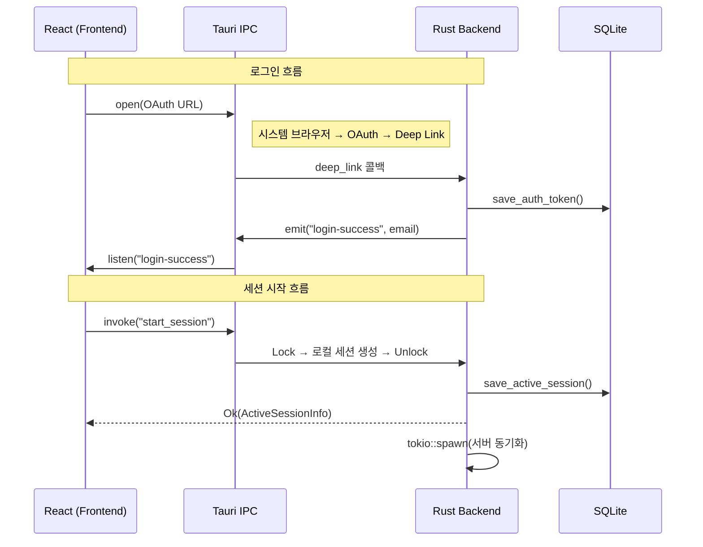
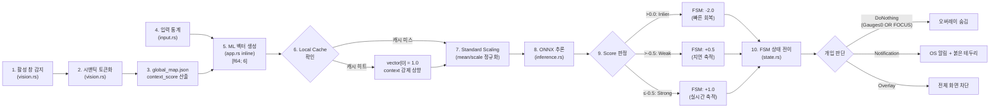
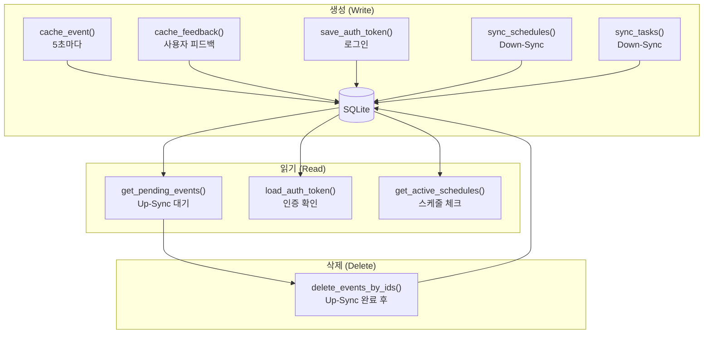

# 데이터 흐름도

> **작성일**: 2026-03-21
> **최종 업데이트**: 2026-04-19 (ML 파이프라인 다이어그램 정확도 개선)

---

## 1. Frontend ↔ Backend 통신

---

## 2. ML 추론 파이프라인

> **핵심 변경**: Local Cache는 ONNX 추론 **이전**에 동작합니다.
> 캐시 히트 시 추론을 건너뛰는 것이 아니라, `input_vector[0]`을 1.0으로 수정하여 **모델이 Inlier로 판정하도록 유도**합니다.

---

## 3. SQLite 데이터 생명주기

---

## 4. 양방향 서버 동기화

| 방향 | 데이터 | 주기 | 방식 |
|------|--------|------|------|
| **Up-Sync** | Cached Events (50/batch) | 60초 | Lock→Read→Unlock → API POST → Lock→Delete→Unlock |
| **Up-Sync** | Cached Feedbacks (50/batch) | 60초 | 동일 패턴 |
| **Down-Sync** | Tasks, Schedules | 60초 | API GET → Lock→Write→Unlock |

> `sync.rs` (116줄)에서 `api.rs`의 `BackendCommunicator`를 통해 동기화 수행.
