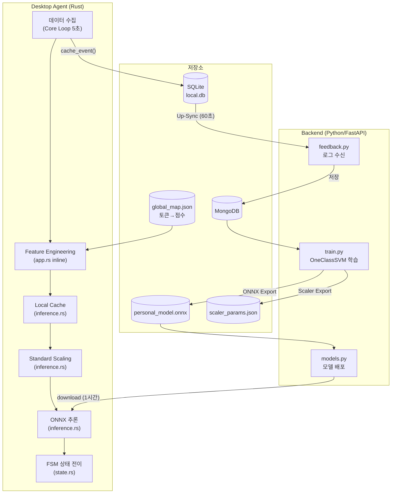
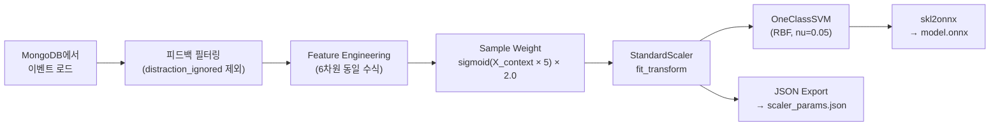
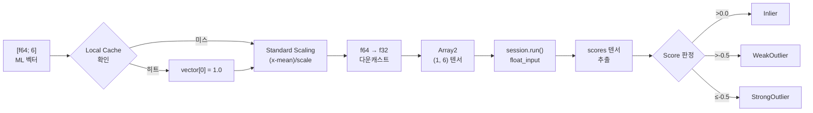
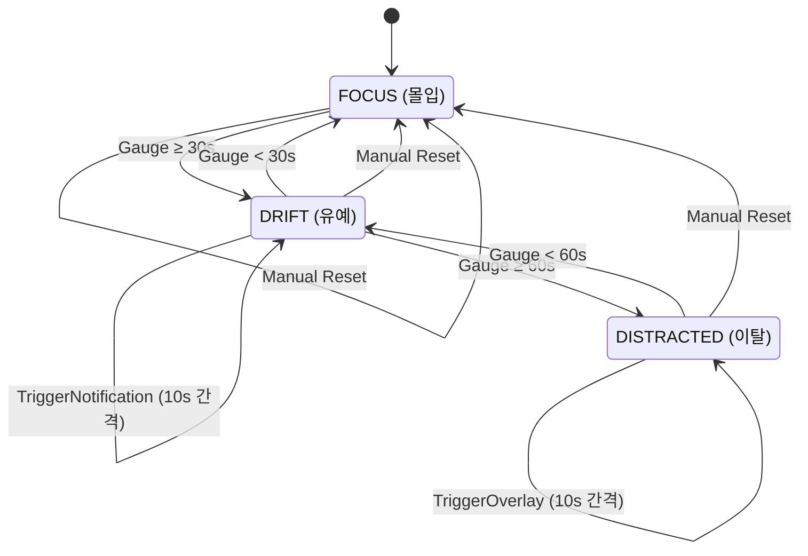
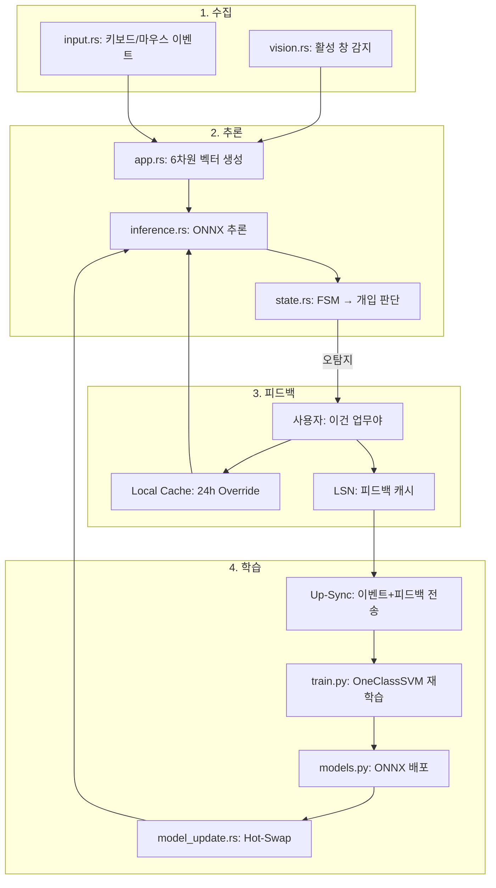

# ML 파이프라인 — 훈련부터 추론까지

> **범위**: 서버 학습 (`backend/ml/train.py`) → 모델 배포 → 클라이언트 추론 (`ai/inference.rs`, `core/app.rs`, `core/state.rs`)
> **작성일**: 2026-04-12 (원본 ML_models.md)
> **최종 업데이트**: 2026-04-25 (코드 대조 완료, 전면 재작성)

---

## 1. 시스템 개요



### 핵심 전략

| 원칙 | 구현 |
|------|------|
| **Global Knowledge** | `global_map.json` — 앱/토큰별 사전 정의 점수 (-1.0~1.0) |
| **Local Override** | 사용자 피드백 → `local_cache` (TTL 24h) → `context_score` 강제 1.0 |
| **Safety Net** | 불확실할 때 개입하지 않음. 마우스만 활성 시 +0.25 감쇄 |
| **Personalization** | 각 사용자별 OneClassSVM 모델 학습 → ONNX 배포 |

---

## 2. 데이터 수집 (클라이언트)

### 2.1 시맨틱 토큰화 (`commands/vision.rs`)

```
입력: App Name + Window Title
  ↓
1. 합산: "{app_name} {title}"
2. 소문자 변환
3. 비영숫자 문자로 분할 (space, dot, dash 등)
4. 빈 토큰 제거
5. 중복 제거 (순서 유지, 최초 출현만 보존)
  ↓
출력: ["visual", "studio", "code", "project", "main", "rs"]
```

> 원본 창 제목은 토큰화된 문자열로 **세탁**됩니다 (개인정보 보호). `app.rs:233-240`에서 `window.title = tokens.join(" ")`로 대체.

### 2.2 컨텍스트 점수 산출 (`app.rs:119-144`)

```
context_score = Σ S(token_i) / count(matched_tokens)
```

| 단계 | 로직 | 참조 |
|------|------|------|
| 1. Exact Match | `global_map.get(token)` — 사전 룩업 | `app.rs:133` |
| 2. Unknown | 매칭 토큰 없으면 → 0.0 (Neutral) | `app.rs:140` |
| 3. 평균 | 매칭된 점수들의 산술 평균 | `app.rs:143` |

> ⚠️ 기존 스펙의 **Fuzzy Match (Levenshtein Distance)**는 현재 코드에 **미구현**입니다. Exact Match만 사용합니다.

---

## 3. Feature Engineering — 6차원 ML 벡터

> 구현 위치: `core/app.rs:259-316` (인라인)

$$V_{input} = [\underbrace{X_{context}}_{Axis\ 1},\ \underbrace{X_{log\_input},\ X_{silence},\ X_{burstiness},\ X_{mouse}}_{Axis\ 2},\ \underbrace{X_{interaction}}_{Axis\ 3}]$$

### Axis 1: Context Score `[1 dim]`

| Feature | 계산 | 범위 | 코드 위치 |
|---------|------|------|-----------|
| `context_score` | 앱/제목 토큰 → `global_map` 룩업 평균 | -1.0 ~ 1.0 | `app.rs:274` |

### Axis 2: Activity Metrics `[4 dims]`

| Feature | 계산 | 범위 | 코드 위치 |
|---------|------|------|-----------|
| `x_log_input` | `ln(delta + 1)`, delta는 max 50으로 clip (Winsorization) | 0 ~ ~3.93 | `app.rs:267,292` |
| `silence_sec` | `(now_ms - last_meaningful_input_ms) / 1000` | 0 ~ ∞ | `app.rs:269-271` |
| `x_burstiness` | delta_history 표본 표준편차 (최근 12개, 5초 × 12 = 1분 윈도우) | 0 ~ ∞ | `app.rs:295-302` |
| `x_mouse` | 5초 내 마우스 이동 여부 (binary) | 0.0 / 1.0 | `app.rs:278-288` |

### Axis 3: Interaction Gate `[1 dim]`

| Feature | 계산 | 범위 | 코드 위치 |
|---------|------|------|-----------|
| `x_interaction` | `sigmoid(1 / (delta + 0.1)) × context_score` | -1.0 ~ 1.0 | `app.rs:304-306` |

**Interaction Gate 동작:**

| 상황 | delta | Gate ≈ | `x_interaction` |
|------|-------|--------|-----------------|
| 키보드 타이핑 중 (높은 입력) | 50 | ~0.52 | context × 0.52 (약화) |
| 입력 없음 (모니터만 보는 중) | 0 | ~1.0 | ≈ context (컨텍스트가 판정을 지배) |

---

## 4. 서버측 학습 (`backend/ml/train.py`)

### 4.1 학습 프로세스



### 4.2 모델 사양

| 항목 | 값 | 설명 |
|------|-----|------|
| **알고리즘** | OneClassSVM | 정상 패턴 경계를 학습하는 비지도 학습 |
| **Kernel** | RBF (Radial Basis Function) | 비선형 결정 경계 |
| **nu (ν)** | 0.05 | 이상치 허용 비율 (~5%) |
| **gamma (γ)** | `scale` | `1 / (n_features × X.var())` 자동 계산 |
| **입력 차원** | 6 (`float_input`) | `FloatTensorType([None, 6])` |
| **출력** | `scores` 텐서 | Decision Function Value (실수) |
| **최소 학습 데이터** | 50개 이벤트 | 미만 시 학습 스킵 |

### 4.3 Sample Weighting

```
W_total = sigmoid(X_context × 5) × 2.0
```

- 높은 `context_score` (업무 앱) → 높은 가중치 → "정상" 경계에 강하게 반영
- 낮은 `context_score` (이탈 앱) → 낮은 가중치 → 경계에 약하게 반영

### 4.4 출력 아티팩트

| 파일 | 형식 | 내용 |
|------|------|------|
| `personal_model.onnx` | ONNX | OneClassSVM 모델 (`skl2onnx` 변환) |
| `scaler_params.json` | JSON | `{ "mean": [f64; 6], "scale": [f64; 6] }` |

---

## 5. 모델 배포 및 Hot-Swap

### 5.1 배포 흐름 (`ai/model_update.rs`)

```mermaid
sequenceDiagram
    participant LOOP as Background (1시간)
    participant MUM as ModelUpdateManager
    participant API as Backend API
    participant FS as 파일 시스템
    participant AC as AppCore
    participant IE as InferenceEngine

    LOOP->>MUM: check_and_update(token)
    MUM->>API: check_latest_model_version()
    API-->>MUM: ModelInfo (version, urls)

    MUM->>API: download → temp_model.onnx
    MUM->>API: download → temp_scaler.json

    MUM->>AC: lock()
    AC->>IE: inference_engine = None (파일 핸들 해제)
    Note over MUM: sleep(100ms) — Windows 파일 락 대기

    MUM->>FS: rename(current → .bak)
    MUM->>FS: rename(temp → final)

    MUM->>IE: InferenceEngine::new() → AppCore에 주입
    MUM-->>AC: unlock()
```

### 5.2 ONNX 세션 Lifecycle

| 함수 | 동작 | 스케일러 갱신 |
|------|------|-------------|
| `unload_model()` | `session = None` → OS 파일 핸들 반환 | ❌ |
| `load_model(path)` | 모델만 새로 로드 (스케일러 기존 경로 재사용) | ❌ |
| `reload(path)` | Unload → `sleep(100ms)` → 모델 + **스케일러 모두** 새로 로드 | ✅ |

> ⚠️ `reload()`만 스케일러를 갱신합니다. 모델과 스케일러가 쌍으로 업데이트될 때 `load_model()`을 사용하면 불일치가 발생합니다.

### 5.3 파일 경로

```
%APPDATA%/com.force-focus.app/
└── models/
    ├── personal_model.onnx      (현재 모델)
    ├── personal_model.bak       (이전 모델 백업)
    ├── scaler_params.json       (현재 스케일러)
    ├── temp_model.onnx          (다운로드 임시)
    └── temp_scaler.json         (다운로드 임시)
```

---

## 6. 클라이언트 추론 (`ai/inference.rs` — 163줄)

### 6.1 추론 파이프라인



### 6.2 Standard Scaling 전처리 (`inference.rs:168-173`)

```rust
for i in 0..6 {
    let val = (input_vector[i] - self.scaler.mean[i]) / self.scaler.scale[i];
    scaled_input[[0, i]] = val as f32;
}
```

### 6.3 Score → InferenceResult 판정 (`inference.rs:186-193`)

| 조건 | 결과 | 의미 | FSM Multiplier |
|------|------|------|----------------|
| `score > 0.0` | **Inlier** | 정상 (업무 중) | -2.0 (빠른 회복) |
| `-0.5 < score ≤ 0.0` | **WeakOutlier** | 애매한 이탈 | +0.5 (지연 축적) |
| `score ≤ -0.5` | **StrongOutlier** | 확정적 이탈 | +1.0 (실시간 축적) |

### 6.4 Local Cache 피드백 메커니즘 (`inference.rs:127-161`)

| 항목 | 구현 |
|------|------|
| **트리거** | 사용자 "이건 업무야" 버튼 → `submit_feedback("is_work")` |
| **캐시 키** | `active_tokens.join(" ")` — 토큰 전체를 공백으로 합친 문자열 (e.g. `"youtube lecture"`) |
| **캐시 값** | `Instant` (TTL 만료 시간) |
| **기본 TTL** | 4시간 |
| **히트 시 동작** | **ONNX 추론 전체 건너뛰기** — `return Ok((100.0, Inlier))` (Short-circuit) |
| **만료 처리** | 조회 시 만료 확인 → 히트 무시 (Lazy) |
| **매칭 규칙** | 토큰 조합 문자열이 **정확히 일치**해야 히트 (부분 매칭 불가) |

---

## 7. FSM 상태 머신 (`core/state.rs`)

### 7.1 상태 전이



### 7.2 Drift Gauge (Leaky Bucket)

| 항목 | 값 |
|------|-----|
| **범위** | 0.0 ~ 90.0 (block=60 + 여유 30) |
| **DRIFT 임계값** | 30.0초 |
| **DISTRACTED 임계값** | 60.0초 |
| **Snooze** | 10.0초 (개입 후 재발생 억제) |

### 7.3 Multiplier 규칙 (`state.rs:95-`)

| 상황 | Multiplier | 의미 |
|------|-----------|------|
| StrongOutlier | +1.0 | 실시간 속도로 게이지 축적 |
| WeakOutlier (+ 입력 있음) | +0.5 | 절반 속도로 축적 |
| WeakOutlier (입력 없음 + 마우스 활성) | +0.25 | **Safety Net**: 읽기/사고 상태 고려 |
| Inlier | -2.0 | 빠른 회복 (15초면 30s 게이지 소진) |

### 7.4 개입 조건

| 개입 | 조건 | UI |
|------|------|-----|
| DoNothing (오버레이 숨김) | Gauge ≤ 0 **OR** FOCUS 상태 | — |
| TriggerNotification | DRIFT + Snooze 만료 | 붉은 테두리 (클릭 통과) |
| TriggerOverlay | DISTRACTED + Snooze 만료 | 전체 화면 차단 + **작업 복귀 버튼** |

---

## 8. Closed-Loop: 전체 사이클



| 단계 | 주기 | 설명 |
|------|------|------|
| **수집** | 5초 | Core Loop에서 감지 + 벡터 생성 + LSN 캐싱 |
| **추론** | 5초 | ONNX 추론 → FSM 전이 → 개입 |
| **피드백** (단기) | 즉시 | Local Cache → 4h 동안 동일 앱 Inlier 유도 |
| **피드백** (중기) | 60초 | Up-Sync로 서버에 이벤트+피드백 전송 |
| **학습** | 피드백 수신 시 | 서버에서 OneClassSVM 재학습 (50개 이상) |
| **배포** | 1시간 | `model_update.rs`에서 최신 모델 확인 + Hot-Swap |

---

## 9. 알려진 제약 및 개선 방향

| # | 항목 | 현재 | 개선 방향 |
|---|------|------|-----------|
| 1 | Fuzzy Match | 미구현 (Exact Match만) | Levenshtein Distance 도입 |
| 2 | 재학습 빈도 | 피드백 1개당 전체 재학습 | Threshold 기반 (e.g. 10개 누적 시) |
| 3 | 버전 비교 | 매번 다운로드 시도 | 로컬 버전과 비교 후 필요 시만 |
| 4 | 모델 복구 | `.bak` 파일 활용 미구현 | 로드 실패 시 `.bak`에서 자동 복구 |
| 5 | `reload()` vs `load_model()` | 스케일러 갱신 불일치 | `load_model()`에도 스케일러 갱신 추가 |
| 6 | 동기 sleep | `thread::sleep(100ms)` 사용 | `tokio::time::sleep` 전환 |
| 7 | 캐시 정리 | Lazy Deletion (borrow checker 이슈) | `HashMap::retain()` 사용 |
