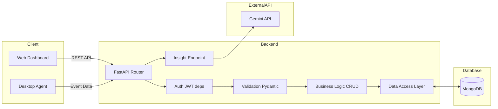
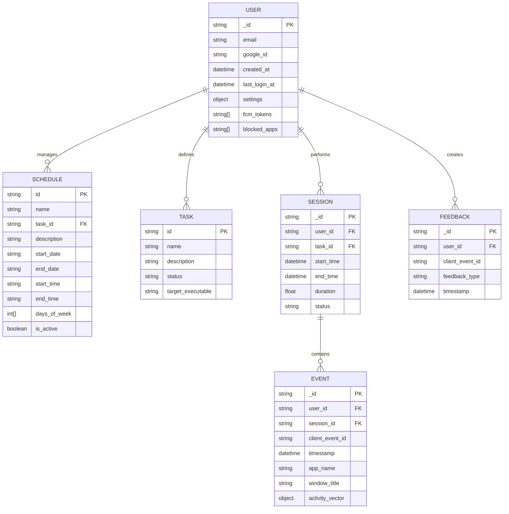

# Force-Focus Backend

## 1. 목표와 기능

### 1.1 목표
- **Force-Focus Backend 시스템** :  
  Force-Focus Backend는 사용자 집중 관리 시스템의 핵심 서버로서,  
  웹 대시보드와 데스크탑 에이전트로부터 전달되는 데이터를 처리하고 저장하며  
  일관된 API를 통해 전체 시스템을 연결하는 역할을 수행합니다.

- **중앙 데이터 처리 및 관리** :  
  사용자 정보, 일정(Schedule), 작업(Task), 세션(Session), 이벤트(Event) 등  
  시스템 전반의 데이터를 통합적으로 관리하며, 클라이언트 요청에 대해 안정적인 데이터 처리 환경을 제공합니다.

- **보안 기반 인증 시스템 제공** :  
  Google OAuth 기반 인증과 JWT 토큰을 활용하여 사용자 인증 및 권한 관리를 수행하며,  
  모든 API 요청에 대해 안전한 접근 제어를 보장합니다.

- **확장 가능한 백엔드 구조 설계** :  
  향후 머신러닝 기반 분석 및 피드백 시스템과의 연동을 고려하여  
  확장성과 유지보수성을 갖춘 구조로 설계되었습니다.

---

### 1.2 주요 기능

- **REST API 제공**  
  - 웹 대시보드 및 데스크탑 에이전트와의 통신을 위한 API 제공  
  - `/api/v1` 기반의 일관된 엔드포인트 구조

- **사용자 인증 및 관리**  
  - Google OAuth 기반 로그인 처리  
  - JWT Access Token 기반 인증 방식  
  - 사용자 정보 조회 및 설정 관리

- **일정(Schedule) 및 작업(Task) 관리**  
  - 사용자의 작업 계획 및 작업 유형 데이터 CRUD 기능 제공  
  - 반복 일정, 시간 정보 등 다양한 조건 처리

- **세션(Session) 관리**  
  - 사용자 작업 세션의 시작, 종료 및 상태 관리  
  - 세션 기반 집중 시간 및 활동 기록 관리

- **이벤트(Event) 데이터 수집 및 저장**  
  - 데스크탑 에이전트로부터 전달되는 활동 로그 저장  
  - 앱 사용 정보 및 시간 기반 이벤트 데이터 처리

- **피드백(Feedback) 데이터 연동 지원**  
  - 수집된 세션 및 이벤트 데이터를 기반으로 분석 요청을 처리할 수 있는 구조 제공  
  - 향후 AI 기반 피드백 시스템과의 연동을 위한 데이터 제공 역할 수행


## 2. 개발 환경 및 배포

### 2.1 개발 환경

- **Backend Framework**
  - Python
  - FastAPI

- **Database**
  - MongoDB
  - Motor (Async MongoDB Driver)

- **Authentication**
  - Google OAuth
  - JWT (JSON Web Token)

- **Data Validation**
  - Pydantic v2

- **Infrastructure & DevOps**
  - Containerization : Docker
  - Cloud Platform : Google Cloud Platform (GCP)

---

### 2.2 배포 환경

- Backend Server : Docker Container 기반으로 배포
- Database : MongoDB (클라우드 또는 컨테이너 환경)
- Reverse Proxy : Caddy (HTTPS 및 도메인 연결 처리)

---

## 2.3 시스템 아키텍처


### 구성 요소 설명

- **FastAPI Router**
  - 클라이언트 요청을 처리하는 API 진입점

- **Auth (JWT / deps)**
  - JWT 토큰 검증 및 사용자 인증 처리

- **Validation (Pydantic)**
  - 요청 데이터의 형식 및 타입 검증

- **Business Logic / CRUD Layer**
  - 데이터 생성, 조회, 수정, 삭제 및 비즈니스 로직 처리
  - 입력값 정제 및 데이터 변환 수행

- **Data Access Layer**
  - MongoDB와 직접 통신하는 계층
  - 컬렉션 접근 및 쿼리 실행 담당

- **Insight Endpoint**
  - 세션 및 이벤트 데이터를 기반으로 Gemini API 호출 수행

- **MongoDB**
  - 사용자, 일정, 작업, 세션, 이벤트 데이터 저장

- **Gemini API**
  - 사용자 활동 데이터를 분석하여 피드백 생성

---

## 3. 프로젝트 구조 및 설계

### 3.1 프로젝트 폴더 구조

- 백엔드 시스템은 기능별 역할(API, 인증, 데이터 처리, DB 접근 등)을 기준으로 계층적으로 분리된 구조로 설계되었습니다.


```text
📦backend/app/
├── 📂api/
│   ├── 📂endpoints/
│   │   ├── 📂web/        # 웹 대시보드 API
│   │   ├── 📂desktop/    # 데스크탑 에이전트 API
│   │   └── 📂user/       # 사용자 관련 API
│   └── 📜deps.py         # JWT 인증 및 공통 의존성
│
├── 📂core/
│   ├── 📜config.py       # 환경 변수 및 설정 관리
│   └── 📜security.py     # JWT 생성 및 검증
│
├── 📂crud/               # 비즈니스 로직 및 데이터 처리
│   ├── 📜users.py
│   ├── 📜tasks.py
│   ├── 📜schedules.py
│   ├── 📜sessions.py
│   ├── 📜event.py
│   └── 📜feedback.py
│
├── 📂db/
│   └── 📜mongo.py        # MongoDB 연결 및 초기화
│
├── 📂models/             # 도메인 데이터 모델 정의
│   ├── 📜user.py
│   ├── 📜task.py
│   ├── 📜schedule.py
│   ├── 📜session.py
│   ├── 📜event.py
│   └── 📜feedback.py
│
├── 📂schemas/            # 요청/응답 데이터 검증
│   ├── 📜user.py
│   ├── 📜task.py
│   ├── 📜schedule.py
│   ├── 📜session.py
│   ├── 📜event.py
│   └── 📜feedback.py
│
├── 📂ml/                 # 머신러닝 관련 코드
│   └── 📜train.py
│
└── 📜main.py             # FastAPI 애플리케이션 진입점
```
---

### 3.2 주요 디렉토리 설명

- **api/endpoints/**
  - 기능별 API 라우터 정의
  - web / desktop / user 환경별로 분리하여 구성

- **core/**
  - 시스템 전반의 설정 및 보안 로직 관리
  - JWT 인증 및 환경 변수 처리 담당

- **crud/**
  - 데이터 처리 및 비즈니스 로직 수행
  - MongoDB와의 데이터 연동 및 데이터 정제 처리

- **db/**
  - MongoDB 연결 및 데이터베이스 접근 관리

- **models/**
  - 도메인 중심의 내부 데이터 모델 정의
  - User, Task, Session, Event 등 주요 엔티티 구조 표현

- **schemas/**
  - Pydantic 기반 요청/응답 데이터 검증
  - API 입력값 검증 및 응답 구조 정의

- **ml/**
  - 머신러닝 관련 기능 및 모델 학습 코드 관리
  - AI 기반 기능 확장을 위한 모듈

- **main.py**
  - FastAPI 애플리케이션 실행 진입점
  - 라우터 등록 및 서버 초기화 수행

---

## 4. 데이터베이스 설계 (ERD)

본 시스템은 NoSQL 데이터베이스인 **MongoDB**를 사용하여  
사용자 활동 데이터와 일정 정보를 유연하게 관리합니다.

각 컬렉션의 구조와 관계는 다음과 같습니다.

---

### 4.1 Entity Relationship Diagram



