# Force-Focus Web dashboard

## 1. 목표와 기능
### 1.1 목표
- **Force-Focus 시스템** : Force-Focus 시스템은 사용자의 작업 환경을 강제로 실행하고, 사용자의 딴짓이 감지될 경우 자동으로 개입하는 기능을 제공하여 사용자의 작업 집중도 향상을 목표로 하는 시스템입니다.

- **통합 관리 대시보드** : 데스크탑 에이전트와 연동되어 사용자의 일정 및 작업 정보, 자신의 작업 세션에 대한 피드백 데이터를 한눈에 조회하고 관리하는 대시보드로서의 역할을 목표로 합니다.

- **실제 데이터 기반의 피드백 제공** : 사용자의 세션 데이터를 활용하여, 사용자의 작업 패턴이나 경향성을 파악하여 이에 맞는 개인화된 형태의 피드백을 제공합니다. (Gemini 2.0 기반 피드백 제공) 

### 1.2 주요 기능
- **일정 및 작업 정보 관리** : 사용자가 자신의 스케줄을 직접 CRUD(생성, 조회, 수정, 삭제) 할 수 있는 인터페이스를 제공합니다.

- **작업 유형별 환경 설정** : 특정 작업 유형에 따라 강제 실행될 프로그램을 사용자가 직접 지정하고 관리할 수 있습니다.

- **Gemini 2.0 기반 활동 피드백** : 사용자의 세션 데이터를 분석하여 AI가 생성한 활동 요약 및 맞춤형 개선 피드백을 제공합니다.

- **실시간 모니터링** : 데스크탑 에이전트에서 사용자의 작업 세션이 완료되면 세션 정보를 실시간으로 반영합니다.

<br>

## 2. 개발 환경 및 배포 URL
### 2.1 개발 환경
- Web Framework
    - Frontend : JavaScript + React
    - Backend : Python + FastAPI

- State Management
    - Zustand (전역 상태 관리 라이브러리)

- Database
    - MongoDB

- Infrastructure & DevOps
    - Containerization : Docker
    - Cloud Platform : Google Cloud Platform (GCP)


### 2.2 배포 URL
- https://34.63.228.213.sslip.io/

### 2.3 시스템 아키텍처

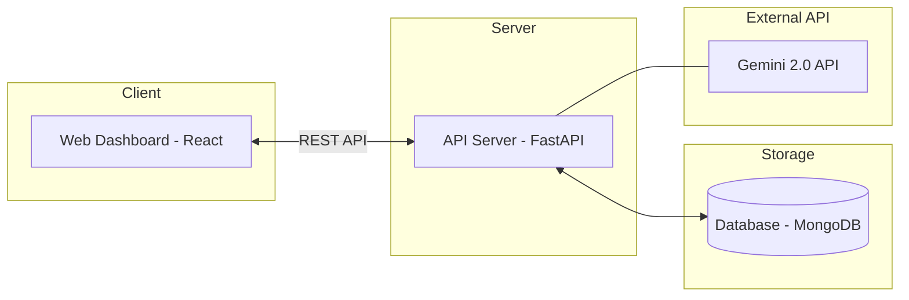

### 2.4 URL 구조
#### 2.4.1 Frontend URL (SPA)
본 프로젝트는 **Single Page Application (SPA)** 방식을 채택하여 대시보드 내 모든 페이지 전환 및 기능 수행이 루트 경로 내에서 동적으로 이루어집니다.

| App | URL | Note |
|:---|:---|:---|
| Web Dashboard | `/` | Zustand 전역 상태 관리에 의한 컴포넌트 스위칭 렌더링 |

<br>

#### 2.4.2 Backend API Endpoints (FastAPI)
백엔드와의 통신은 `axios` 인스턴스를 통해 수행되며, 모든 요청은 `/api/v1`을 Base URL로 사용합니다.

**1) Schedule API**
| Method | Endpoint | 설명 | 로그인 권한 |
|:---:|:---|:---|:---:|
| `GET` | `/schedules/` | 전체 일정 목록 조회 | ✅ |
| `POST` | `/schedules/` | 새로운 일정 생성 | ✅ |
| `GET` | `/schedules/{id}` | 특정 일정 정보 조회 | ✅ |
| `PUT` | `/schedules/{id}` | 특정 일정 정보 수정 | ✅ |
| `DELETE` | `/schedules/{id}` | 특정 일정 삭제 | ✅ |

<br>

**2) Task API**
| Method | Endpoint | 설명 | 로그인 권한 |
|:---:|:---|:---|:---:|
| `GET` | `/tasks/` | 정의된 작업 유형 목록 조회 | ✅ |
| `POST` | `/tasks/` | 새로운 작업 유형 생성 | ✅ |
| `GET` | `/tasks/{id}` | 특정 작업 유형 상세 정보 조회 | ✅ |
| `PUT` | `/tasks/{id}` | 작업 유형 설정 업데이트 | ✅ |
| `DELETE` | `/tasks/{id}` | 작업 유형 삭제 | ✅ |

<br>

**3) Session & Activity API**
| Method | Endpoint | 설명 | 로그인 권한 |
|:---:|:---|:---|:---:|
| `GET` | `/sessions/` | 사용자 활동 세션 기록 조회 | ✅ |
| `GET` | `/events/` | 세션 내 발생한 상세 이벤트 로그 조회 | ✅ |

<br>

**4) Feedback API**
| Method | Endpoint | 설명 | 로그인 권한 |
|:---:|:---|:---|:---:|
| `GET` | `/insight` | Gemini 2.0 기반 피드백 제공 | ✅ |

<br>

**5) Authentication API**
| Method | Endpoint | 설명 | 로그인 권한 |
|:---:|:---|:---|:---:|
| `POST` | `/auth/login` | 사용자 인증 및 토큰 발급 | - |
| `POST` | `/auth/logout` | 세션 종료 및 로그아웃 | ✅ |

<br>

## 3. 프로젝트 구조 및 설계
### 3.1 프로젝트 폴더 구조
웹 대시보드의 프론트엔드 소스코드는 기능별 모듈화를 위해 다음과 같은 구조로 설계되었습니다.

```text
📦src
 ┣ 📂api               # Backend 연동을 위한 Axios 인스턴스 및 API 정의
 ┃ ┣ 📜authApi.js
 ┃ ┣ 📜axiosInstance.js
 ┃ ┣ 📜scheduleApi.js
 ┃ ┣ 📜sessionApi.js
 ┃ ┗ 📜taskApi.js
 ┣ 📂assets
 ┃ ┗ 📜react.svg
 ┣ 📂components        # 재사용 가능한 UI 컴포넌트
 ┃ ┣ 📂layout          # 공통 레이아웃 컴포넌트
 ┃ ┃ ┣ 📂Help          # 도움말 섹션
 ┃ ┃ ┣ 📂InfoBox       # 정보 표시 박스
 ┃ ┃ ┣ 📂MenuBar       # 사이드/네비게이션 바
 ┃ ┃ ┗ 📂TitleBar      # 상단 타이틀 바
 ┃ ┣ 📂login           # 로그인 페이지
 ┃ ┗ 📂menu            # 메인 기능별 상세 컴포넌트
 ┃   ┣ 📂ActivitySummary  # 활동 요약 메뉴
 ┃   ┣ 📂Feedback         # 피드백 메뉴
 ┃   ┣ 📂Overview         # 대시보드 개요
 ┃   ┣ 📂Schedule         # 일정 관리 메뉴
 ┃   ┗ 📂Task             # 작업 유형 설정 메뉴
 ┣ 📂hooks             # 커스텀 훅
 ┃ ┣ 📜useSchedules.js
 ┃ ┗ 📜useTasks.js
 ┣ 📜App.css           
 ┣ 📜App.jsx           
 ┣ 📜index.css         
 ┣ 📜main.jsx          
 ┗ 📜MainStore.jsx     # Zustand를 이용한 전역 상태(Menu, Auth 등) 관리
```

<br>

## 4. 데이터베이스 설계 (ERD)
본 프로젝트는 NoSQL 데이터베이스인 **MongoDB**를 사용하여 비정형 활동 데이터와 유연한 일정 정보를 관리합니다. 각 컬렉션의 구조와 관계는 다음과 같습니다.

### 4.1 Entity Relationship Diagram

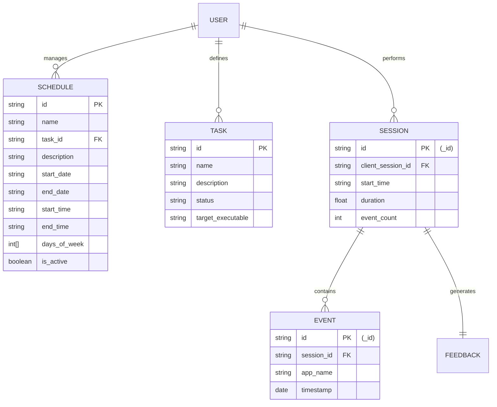

### 4.2 컬렉션별 상세 명세
**1) Schedules (일정 관리)**
사용자가 웹 대시보드에서 설정한 작업 계획 데이터입니다.
* `id`: 일정 고유 식별자 (String / MongoDB ObjectId)
* `name`: 일정 제목 (String)
* `task_id`: 연결된 작업 유형의 ID (String)
* `description`: 일정에 대한 추가 설명 (String)
* `start_date / end_date`: 시작 및 종료 날짜 (String, "YYYY-MM-DD" 포맷)
* `start_time / end_time`: 시작 및 종료 시간 (String, "HH:mm:ss" 포맷)
* `days_of_week`: 반복 요일 (Array<Int>, 0:일 ~ 6:토)
* `is_active`: 활성화 여부 (Boolean)

<br>

**2) Tasks (작업 설정)**
작업 유형별 프로필 및 프로그램 제어 환경을 정의합니다.
* `id`: 작업 고유 식별자 (String)
* `name`: 작업 유형 명칭 (String)
* `description`: 작업 환경 설명 (String)
* `status`: 활성화 여부 (String)
* `target_executable`: 강제 실행 프로그램 목록 (String, 콤마(,)로 구분)

<br>

**3) Sessions (활동 세션)**
데스크탑 에이전트로부터 수집되어 저장된 실제 작업 이력 데이터입니다.
* `_id`: 세션 고유 식별자 (String / MongoDB ObjectId)
* `client_session_id`: 데스크탑 에이전트에서 생성하는 session_id 형식, 각 세션별 events 정보 구분자 (String)
* `start_time`: 각 세션이 시작되는 시간 (String, YYYY-MM-DDTHH:mm:ssZ" 형식)
* `duration`: 각 세션의 지속 시간 (Float)
* `event_count` : 각 세션에서 발생한 입력 이벤트 횟수 (Int)

<br>

**4) Events (상세 활동 로그)**
세션 내에서 발생한 구체적인 입력 이벤트와 관련된 로그입니다.
* `_id`: 이벤트 고유 식별자 (String / UUID 형식)
* `session_id`: Client Session ID와의 매핑 식별자 (String)
* `app_name`: 실행 프로세스 명 (예: `chrome.exe`)
* `timestamp`: 이벤트 발생 시각 (Date / $date 포맷)

<br>

## 5. 메인 기능 상세
- 본 웹 대시보드에서는 **MainStore**에서 Zustand를 통하여 관리되는 상태에 따라 각기 다른 기능을 수행하는 컴포넌트를 렌더링합니다. 
- 각 메뉴의 핵심 기능은 다음과 같습니다.

### 5.1 Overview (대시보드 개요)
* **기능**: 사용자의 현재 상태와 오늘의 요약 정보를 한눈에 제공합니다.
* **상세**: 
    * 현재 활성화된 일정 및 진행 중인 작업 정보 표시
    * 데스크탑 에이전트로부터 수집된 최근 활동 로그의 간략한 대시보드 출력
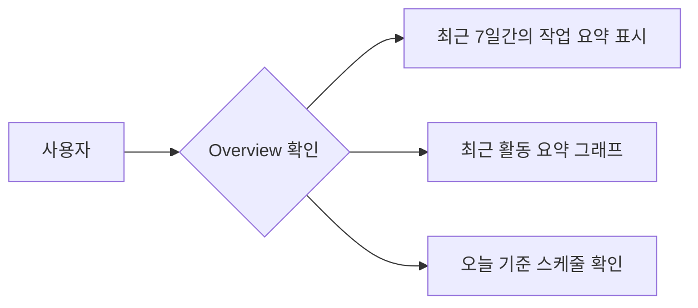

<br>

### 5.2 Schedule (일정 관리)
* **기능**: 사용자의 작업 계획을 설정하고 데이터베이스에 저장합니다.
* **상세**: `useSchedules` 커스텀 훅을 통해 `scheduleApi`와 통신하며 CRUD 기능을 수행합니다.
    * **조회**: 등록된 모든 일정을 리스트 형태로 출력
    * **생성/수정**: 작업명, 시작/종료 시간, 반복 설정 등을 입력 및 백엔드 동기화
    * **삭제**: 불필요한 일정 제거 및 실시간 UI 업데이트
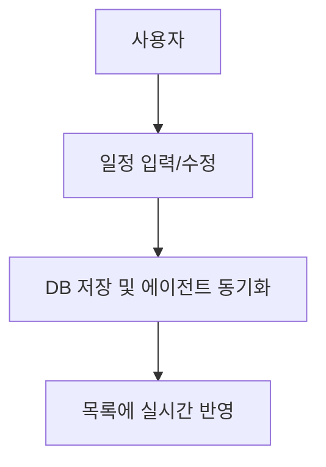

<br>

### 5.3 Task (작업 설정)
* **기능**: 특정 작업 유형에 따른 시스템 강제 사항(프로그램 실행 등)을 정의합니다.
* **상세**: `useTasks` 훅을 사용하여 사용자가 정의한 작업 환경 설정을 관리합니다.
    * **강제 실행 설정**: 특정 Task 시작 시 자동으로 실행될 프로그램 경로 및 환경 변수 지정
    * **환경 제어**: 해당 작업 중 허용/차단할 애플리케이션 리스트 구성
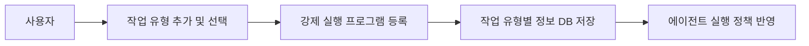

<br>

### 5.4 Activity Summary (활동 요약)
* **기능**: 데스크탑 에이전트가 수집한 세션 및 이벤트 데이터를 시각화합니다.
* **상세**: `sessionApi`를 호출하여 특정 기간의 활동 데이터를 호출합니다.
    * `getSessions`: 사용자의 집중 세션 시작/종료 시간 및 지속 시간 데이터 활용
    * `getEvents`: 세션 내에서 발생한 구체적인 앱 전환, 웹사이트 방문 기록 등 이벤트 로그 출력
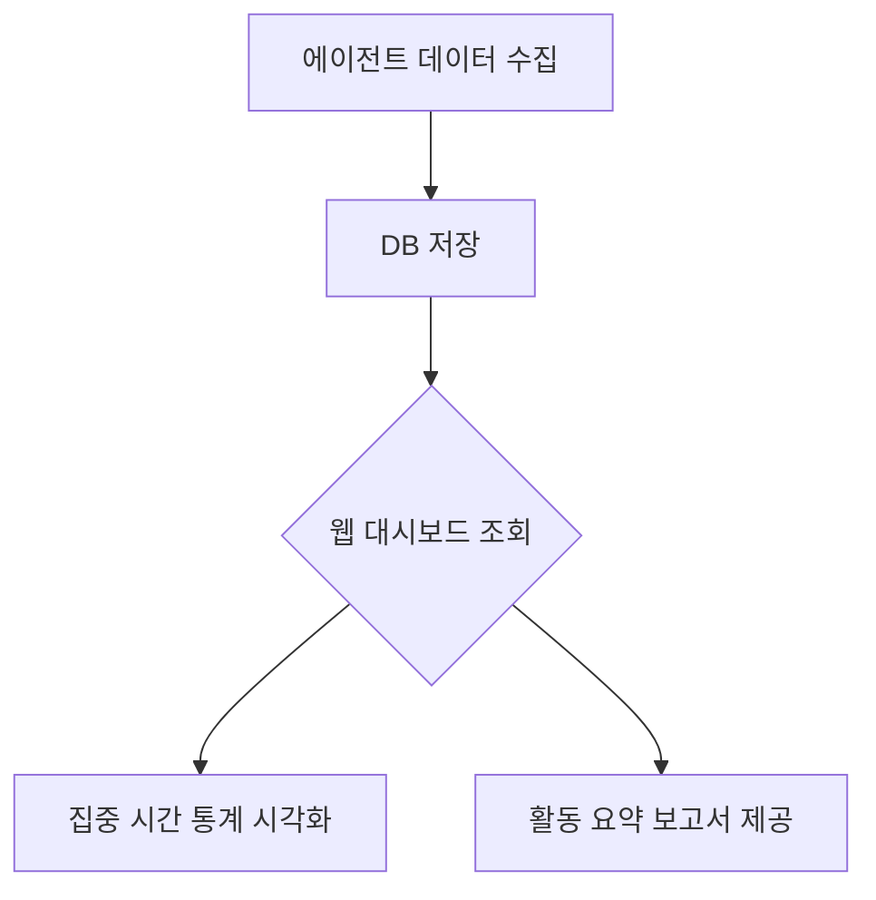

<br>

### 5.5 Feedback (피드백)
* **기능**: **Gemini 2.0** 모델을 활용하여 사용자의 활동을 분석하고 맞춤형 개선안을 제시합니다.
* **상세**:
    * 수집된 활동 데이터(Activity Summary)를 기반으로 AI 분석 요청
    * 사용자의 집중도 패턴 분석, 딴짓 빈도, 작업 효율성에 대한 정성적/정량적 피드백 생성
    * 향후 집중력 향상을 위한 구체적인 작업 환경 개선 가이드 제공
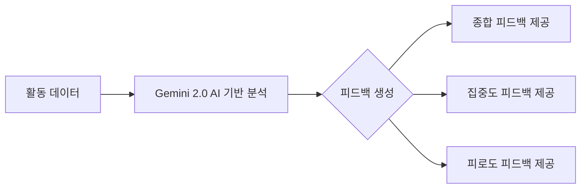

<br>

### 5.6 Authentication (로그인 및 인증)
* **기능**: 보안을 위한 사용자 인증 및 세션 관리를 수행합니다.
* **구현**:
    * `authApi`를 통한 로그인 처리 및 JWT(JSON Web Token) 발급
    * `axiosInstance`의 인터셉터를 활용하여 모든 요청 헤더에 토큰 자동 포함
    * 401 에러 발생 시(세션 만료) 자동으로 상태 초기화 및 로그인 화면으로 리다이렉트
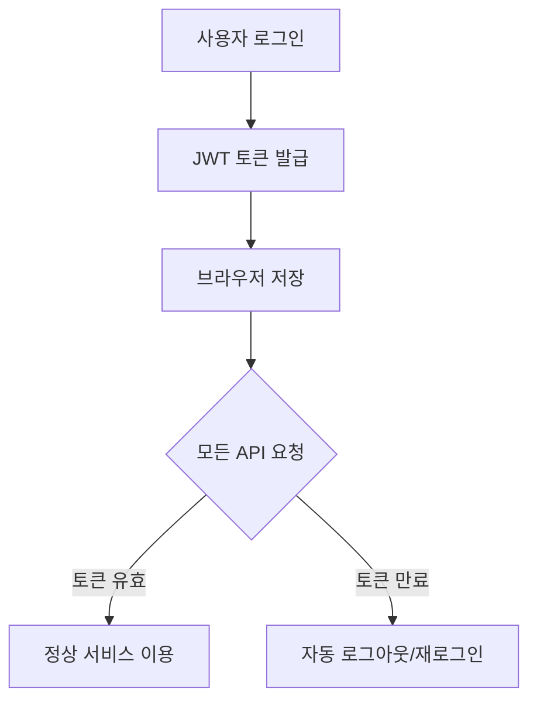

<br>

## 6. 메인 기능별 상세 아키텍처
### 6.1 Schedule (일정 관리)
- 스케줄 진입 시 서버로부터 전체 일정을 불러와 화면에 렌더링합니다. 사용자는 직관적인 모달 인터페이스를 통해 일정의 추가, 수정, 삭제를 수행하며, 각 작업 성공 시 프론트엔드 상태를 서버 데이터와 즉각적으로 동기화하여 최신 상태를 유지합니다.
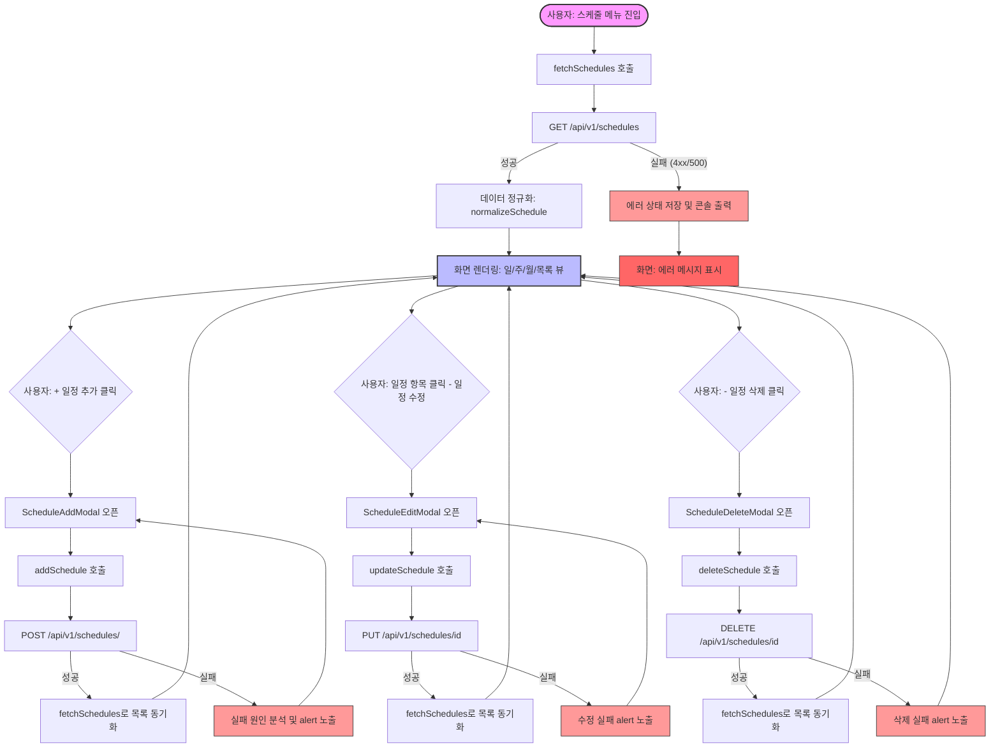
<br>

### 6.2 Task (작업 설정)
- 작업 설정 메뉴는 초기 로드 시 저장된 데이터가 없으면 기본 작업 목록을 자동으로 생성하여 초기화를 지원합니다. 사용자가 그리드 상에서 편집한 내용은 즉시 서버에 반영되지 않고 로컬 상태(isDirty)로 관리되며, '저장하기' 버튼을 클릭할 때 유효성 검사를 거쳐 일괄적으로 백엔드에 업데이트되는 방식으로 동작합니다.
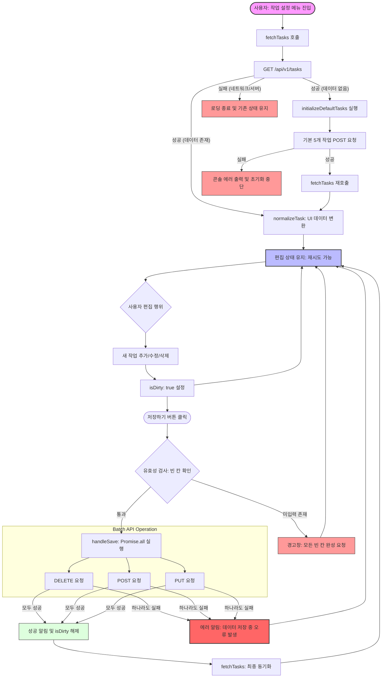
<br>

### 6.3 Activity Summary (활동 요약)
- 인증된 사용자의 최근 7일간 세션과 이벤트 데이터를 병렬로 호출하여 분석 효율성을 극대화합니다. 수집된 원천 데이터를 바탕으로 요일별 활동량, 최다 사용 앱, 집중 강도 등을 프론트엔드 로직으로 산출하며, 이를 AreaChart와 요약 보고서 형태로 시각화하여 제공합니다.
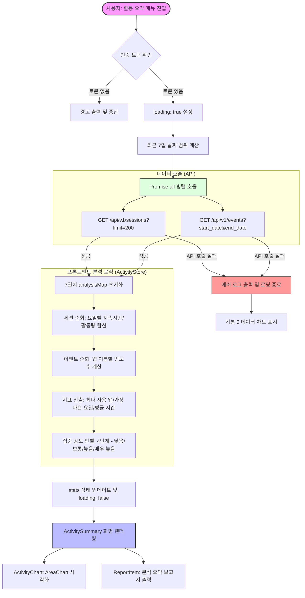
<br>

### 6.4 Feedback (피드백)
- 수신된 분석 데이터를 바탕으로 사용자로부터 선택된 세션에 대하여 종합, 집중도, 피로도라는 세 가지 관점으로 피드백을 제공합니다. 특히 피로도 분석에서는 방해 요소에 대응하는 회복 전략을 자동으로 매핑하며, 제안된 전략이 부족할 경우 시스템이 자체적으로 휴식 권고 사항을 보완하고 애니메이션을 통해 시각적 이해도를 높입니다.
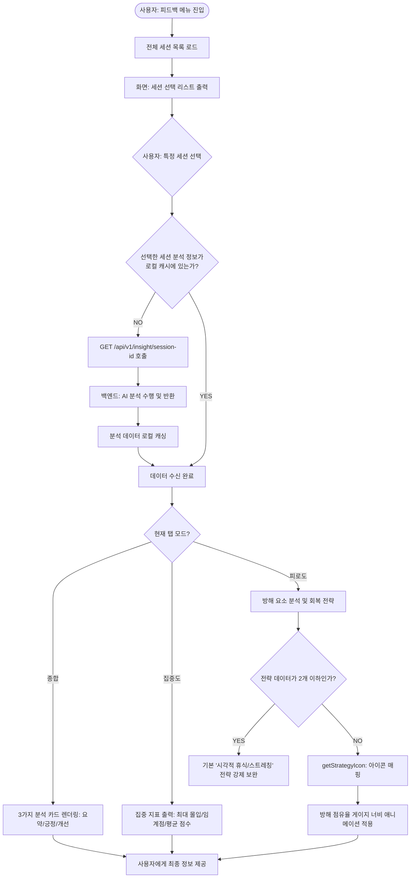
<br>

### 6.5 Authentication (로그인 및 인증)
- Google OAuth를 통한 간편 로그인 방식을 채택하여 사용자의 신원을 안전하게 검증합니다. 백엔드에서 ID 토큰의 유효성을 확인한 후 MongoDB에 사용자 정보를 저장하거나 업데이트하며, 최종적으로 발급된 JWT 토큰을 로컬 스토리지에 저장하여 이후 모든 API 요청의 인증 수단으로 활용합니다.
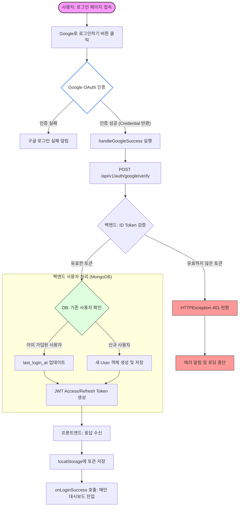

## 7. 요약 및 기대 효과
- Force-Focus 프로젝트는 사용자가 집중할 수밖에 없는 작업 환경을 강제로 조성하여 생산성을 극대화하는 솔루션으로, 기존의 단순 시간 측정(Time-tracker) 앱이나 방해 금지 모드 등과 달리, **실행 강제**라는 심화적인 접근 방식과 **AI 기반 정성 피드백 분석**이라는 기능을 결합하였다는 점에서 의의가 있습니다. 웹 대시보드는 이 프로젝트의 중앙 관제소 역할을 수행함으로써, 데스크탑 에이전트와 연동되어 일정/작업 정보 관리 및 시각화, AI 기반 피드백을 제공하는 역할을 수행합니다.
- 사용자는 이 웹 대시보드의 산출물을 통해서 자신의 집중 임계점을 객관적으로 확인하고, AI가 제안하는 회복 전략을 통해 자신에게 맞는 집중 환경을 조성할 수 있으며, 장기적으로는 더 나은 작업 패턴을 형성할 수 있을 것이 기대됩니다.